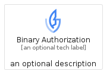
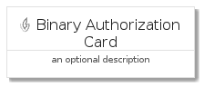

# BinaryAuthorization


```text
gcp/Item/BinaryAuthorization
```

```text
include('gcp/Item/BinaryAuthorization')
```


| Illustration | BinaryAuthorization | BinaryAuthorizationCard | BinaryAuthorizationGroup |
| :---: | :---: | :---: | :---: |
|  |  |  |  |


## BinaryAuthorization

### Load remotely
```plantuml
@startuml
' configures the library
!global $LIB_BASE_LOCATION="https://raw.githubusercontent.com/tmorin/plantuml-libs/master/distribution"

' loads the library's bootstrap
!include $LIB_BASE_LOCATION/bootstrap.puml

' loads the package bootstrap
include('gcp/bootstrap')

' loads the Item which embeds the element BinaryAuthorization
include('gcp/Item/BinaryAuthorization')

' renders the element
BinaryAuthorization('BinaryAuthorization', 'Binary Authorization', 'an optional tech label', 'an optional description')
@enduml
```

### Load locally
```plantuml
@startuml
' configures the library
!global $INCLUSION_MODE="local"
!global $LIB_BASE_LOCATION="../.."

' loads the library's bootstrap
!include $LIB_BASE_LOCATION/bootstrap.puml

' loads the package bootstrap
include('gcp/bootstrap')

' loads the Item which embeds the element BinaryAuthorization
include('gcp/Item/BinaryAuthorization')

' renders the element
BinaryAuthorization('BinaryAuthorization', 'Binary Authorization', 'an optional tech label', 'an optional description')
@enduml
```

## BinaryAuthorizationCard

### Load remotely
```plantuml
@startuml
' configures the library
!global $LIB_BASE_LOCATION="https://raw.githubusercontent.com/tmorin/plantuml-libs/master/distribution"

' loads the library's bootstrap
!include $LIB_BASE_LOCATION/bootstrap.puml

' loads the package bootstrap
include('gcp/bootstrap')

' loads the Item which embeds the element BinaryAuthorizationCard
include('gcp/Item/BinaryAuthorization')

' renders the element
BinaryAuthorizationCard('BinaryAuthorizationCard', 'Binary Authorization Card', 'an optional description')
@enduml
```

### Load locally
```plantuml
@startuml
' configures the library
!global $INCLUSION_MODE="local"
!global $LIB_BASE_LOCATION="../.."

' loads the library's bootstrap
!include $LIB_BASE_LOCATION/bootstrap.puml

' loads the package bootstrap
include('gcp/bootstrap')

' loads the Item which embeds the element BinaryAuthorizationCard
include('gcp/Item/BinaryAuthorization')

' renders the element
BinaryAuthorizationCard('BinaryAuthorizationCard', 'Binary Authorization Card', 'an optional description')
@enduml
```

## BinaryAuthorizationGroup

### Load remotely
```plantuml
@startuml
' configures the library
!global $LIB_BASE_LOCATION="https://raw.githubusercontent.com/tmorin/plantuml-libs/master/distribution"

' loads the library's bootstrap
!include $LIB_BASE_LOCATION/bootstrap.puml

' loads the package bootstrap
include('gcp/bootstrap')

' loads the Item which embeds the element BinaryAuthorizationGroup
include('gcp/Item/BinaryAuthorization')

' renders the element
BinaryAuthorizationGroup('BinaryAuthorizationGroup', 'Binary Authorization Group', 'an optional tech label') {
    note as note
        the content of the group
    end note
}
@enduml
```

### Load locally
```plantuml
@startuml
' configures the library
!global $INCLUSION_MODE="local"
!global $LIB_BASE_LOCATION="../.."

' loads the library's bootstrap
!include $LIB_BASE_LOCATION/bootstrap.puml

' loads the package bootstrap
include('gcp/bootstrap')

' loads the Item which embeds the element BinaryAuthorizationGroup
include('gcp/Item/BinaryAuthorization')

' renders the element
BinaryAuthorizationGroup('BinaryAuthorizationGroup', 'Binary Authorization Group', 'an optional tech label') {
    note as note
        the content of the group
    end note
}
@enduml
```

