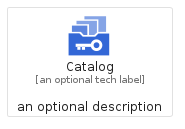
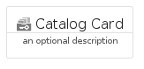
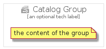

# Catalog


```text
gcp/Item/Catalog
```

```text
include('gcp/Item/Catalog')
```


| Illustration | Catalog | CatalogCard | CatalogGroup |
| :---: | :---: | :---: | :---: |
|  |  |  |  |


## Sprites
The item provides the following sriptes:

- `<$CatalogXs>`
- `<$CatalogSm>`
- `<$CatalogMd>`
- `<$CatalogLg>`


## Catalog

### Load remotely
```plantuml
@startuml
' configures the library
!global $LIB_BASE_LOCATION="https://raw.githubusercontent.com/tmorin/plantuml-libs/master/distribution"

' loads the library's bootstrap
!include $LIB_BASE_LOCATION/bootstrap.puml

' loads the package bootstrap
include('gcp/bootstrap')

' loads the Item which embeds the element Catalog
include('gcp/Item/Catalog')

' renders the element
Catalog('Catalog', 'Catalog', 'an optional tech label', 'an optional description')
@enduml
```

### Load locally
```plantuml
@startuml
' configures the library
!global $INCLUSION_MODE="local"
!global $LIB_BASE_LOCATION="../.."

' loads the library's bootstrap
!include $LIB_BASE_LOCATION/bootstrap.puml

' loads the package bootstrap
include('gcp/bootstrap')

' loads the Item which embeds the element Catalog
include('gcp/Item/Catalog')

' renders the element
Catalog('Catalog', 'Catalog', 'an optional tech label', 'an optional description')
@enduml
```

## CatalogCard

### Load remotely
```plantuml
@startuml
' configures the library
!global $LIB_BASE_LOCATION="https://raw.githubusercontent.com/tmorin/plantuml-libs/master/distribution"

' loads the library's bootstrap
!include $LIB_BASE_LOCATION/bootstrap.puml

' loads the package bootstrap
include('gcp/bootstrap')

' loads the Item which embeds the element CatalogCard
include('gcp/Item/Catalog')

' renders the element
CatalogCard('CatalogCard', 'Catalog Card', 'an optional description')
@enduml
```

### Load locally
```plantuml
@startuml
' configures the library
!global $INCLUSION_MODE="local"
!global $LIB_BASE_LOCATION="../.."

' loads the library's bootstrap
!include $LIB_BASE_LOCATION/bootstrap.puml

' loads the package bootstrap
include('gcp/bootstrap')

' loads the Item which embeds the element CatalogCard
include('gcp/Item/Catalog')

' renders the element
CatalogCard('CatalogCard', 'Catalog Card', 'an optional description')
@enduml
```

## CatalogGroup

### Load remotely
```plantuml
@startuml
' configures the library
!global $LIB_BASE_LOCATION="https://raw.githubusercontent.com/tmorin/plantuml-libs/master/distribution"

' loads the library's bootstrap
!include $LIB_BASE_LOCATION/bootstrap.puml

' loads the package bootstrap
include('gcp/bootstrap')

' loads the Item which embeds the element CatalogGroup
include('gcp/Item/Catalog')

' renders the element
CatalogGroup('CatalogGroup', 'Catalog Group', 'an optional tech label') {
    note as note
        the content of the group
    end note
}
@enduml
```

### Load locally
```plantuml
@startuml
' configures the library
!global $INCLUSION_MODE="local"
!global $LIB_BASE_LOCATION="../.."

' loads the library's bootstrap
!include $LIB_BASE_LOCATION/bootstrap.puml

' loads the package bootstrap
include('gcp/bootstrap')

' loads the Item which embeds the element CatalogGroup
include('gcp/Item/Catalog')

' renders the element
CatalogGroup('CatalogGroup', 'Catalog Group', 'an optional tech label') {
    note as note
        the content of the group
    end note
}
@enduml
```

