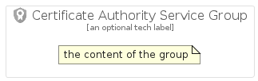

# CertificateAuthorityService


```text
gcp/Item/CertificateAuthorityService
```

```text
include('gcp/Item/CertificateAuthorityService')
```


| Illustration | CertificateAuthorityService | CertificateAuthorityServiceCard | CertificateAuthorityServiceGroup |
| :---: | :---: | :---: | :---: |
|  |  |  |  |


## CertificateAuthorityService

### Load remotely
```plantuml
@startuml
' configures the library
!global $LIB_BASE_LOCATION="https://raw.githubusercontent.com/tmorin/plantuml-libs/master/distribution"

' loads the library's bootstrap
!include $LIB_BASE_LOCATION/bootstrap.puml

' loads the package bootstrap
include('gcp/bootstrap')

' loads the Item which embeds the element CertificateAuthorityService
include('gcp/Item/CertificateAuthorityService')

' renders the element
CertificateAuthorityService('CertificateAuthorityService', 'Certificate Authority Service', 'an optional tech label')
@enduml
```

### Load locally
```plantuml
@startuml
' configures the library
!global $INCLUSION_MODE="local"
!global $LIB_BASE_LOCATION="../.."

' loads the library's bootstrap
!include $LIB_BASE_LOCATION/bootstrap.puml

' loads the package bootstrap
include('gcp/bootstrap')

' loads the Item which embeds the element CertificateAuthorityService
include('gcp/Item/CertificateAuthorityService')

' renders the element
CertificateAuthorityService('CertificateAuthorityService', 'Certificate Authority Service', 'an optional tech label')
@enduml
```

## CertificateAuthorityServiceCard

### Load remotely
```plantuml
@startuml
' configures the library
!global $LIB_BASE_LOCATION="https://raw.githubusercontent.com/tmorin/plantuml-libs/master/distribution"

' loads the library's bootstrap
!include $LIB_BASE_LOCATION/bootstrap.puml

' loads the package bootstrap
include('gcp/bootstrap')

' loads the Item which embeds the element CertificateAuthorityServiceCard
include('gcp/Item/CertificateAuthorityService')

' renders the element
CertificateAuthorityServiceCard('CertificateAuthorityServiceCard', 'Certificate Authority Service Card', 'an optional description')
@enduml
```

### Load locally
```plantuml
@startuml
' configures the library
!global $INCLUSION_MODE="local"
!global $LIB_BASE_LOCATION="../.."

' loads the library's bootstrap
!include $LIB_BASE_LOCATION/bootstrap.puml

' loads the package bootstrap
include('gcp/bootstrap')

' loads the Item which embeds the element CertificateAuthorityServiceCard
include('gcp/Item/CertificateAuthorityService')

' renders the element
CertificateAuthorityServiceCard('CertificateAuthorityServiceCard', 'Certificate Authority Service Card', 'an optional description')
@enduml
```

## CertificateAuthorityServiceGroup

### Load remotely
```plantuml
@startuml
' configures the library
!global $LIB_BASE_LOCATION="https://raw.githubusercontent.com/tmorin/plantuml-libs/master/distribution"

' loads the library's bootstrap
!include $LIB_BASE_LOCATION/bootstrap.puml

' loads the package bootstrap
include('gcp/bootstrap')

' loads the Item which embeds the element CertificateAuthorityServiceGroup
include('gcp/Item/CertificateAuthorityService')

' renders the element
CertificateAuthorityServiceGroup('CertificateAuthorityServiceGroup', 'Certificate Authority Service Group', 'an optional tech label') {
    note as note
        the content of the group
    end note
}
@enduml
```

### Load locally
```plantuml
@startuml
' configures the library
!global $INCLUSION_MODE="local"
!global $LIB_BASE_LOCATION="../.."

' loads the library's bootstrap
!include $LIB_BASE_LOCATION/bootstrap.puml

' loads the package bootstrap
include('gcp/bootstrap')

' loads the Item which embeds the element CertificateAuthorityServiceGroup
include('gcp/Item/CertificateAuthorityService')

' renders the element
CertificateAuthorityServiceGroup('CertificateAuthorityServiceGroup', 'Certificate Authority Service Group', 'an optional tech label') {
    note as note
        the content of the group
    end note
}
@enduml
```

