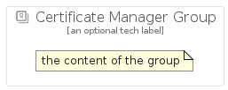

# CertificateManager


```text
gcp/Item/CertificateManager
```

```text
include('gcp/Item/CertificateManager')
```


| Illustration | CertificateManager | CertificateManagerCard | CertificateManagerGroup |
| :---: | :---: | :---: | :---: |
|  |  |  |  |


## Sprites
The item provides the following sriptes:

- `<$CertificateManagerXs>`
- `<$CertificateManagerSm>`
- `<$CertificateManagerMd>`
- `<$CertificateManagerLg>`


## CertificateManager

### Load remotely
```plantuml
@startuml
' configures the library
!global $LIB_BASE_LOCATION="https://raw.githubusercontent.com/tmorin/plantuml-libs/master/distribution"

' loads the library's bootstrap
!include $LIB_BASE_LOCATION/bootstrap.puml

' loads the package bootstrap
include('gcp/bootstrap')

' loads the Item which embeds the element CertificateManager
include('gcp/Item/CertificateManager')

' renders the element
CertificateManager('CertificateManager', 'Certificate Manager', 'an optional tech label', 'an optional description')
@enduml
```

### Load locally
```plantuml
@startuml
' configures the library
!global $INCLUSION_MODE="local"
!global $LIB_BASE_LOCATION="../.."

' loads the library's bootstrap
!include $LIB_BASE_LOCATION/bootstrap.puml

' loads the package bootstrap
include('gcp/bootstrap')

' loads the Item which embeds the element CertificateManager
include('gcp/Item/CertificateManager')

' renders the element
CertificateManager('CertificateManager', 'Certificate Manager', 'an optional tech label', 'an optional description')
@enduml
```

## CertificateManagerCard

### Load remotely
```plantuml
@startuml
' configures the library
!global $LIB_BASE_LOCATION="https://raw.githubusercontent.com/tmorin/plantuml-libs/master/distribution"

' loads the library's bootstrap
!include $LIB_BASE_LOCATION/bootstrap.puml

' loads the package bootstrap
include('gcp/bootstrap')

' loads the Item which embeds the element CertificateManagerCard
include('gcp/Item/CertificateManager')

' renders the element
CertificateManagerCard('CertificateManagerCard', 'Certificate Manager Card', 'an optional description')
@enduml
```

### Load locally
```plantuml
@startuml
' configures the library
!global $INCLUSION_MODE="local"
!global $LIB_BASE_LOCATION="../.."

' loads the library's bootstrap
!include $LIB_BASE_LOCATION/bootstrap.puml

' loads the package bootstrap
include('gcp/bootstrap')

' loads the Item which embeds the element CertificateManagerCard
include('gcp/Item/CertificateManager')

' renders the element
CertificateManagerCard('CertificateManagerCard', 'Certificate Manager Card', 'an optional description')
@enduml
```

## CertificateManagerGroup

### Load remotely
```plantuml
@startuml
' configures the library
!global $LIB_BASE_LOCATION="https://raw.githubusercontent.com/tmorin/plantuml-libs/master/distribution"

' loads the library's bootstrap
!include $LIB_BASE_LOCATION/bootstrap.puml

' loads the package bootstrap
include('gcp/bootstrap')

' loads the Item which embeds the element CertificateManagerGroup
include('gcp/Item/CertificateManager')

' renders the element
CertificateManagerGroup('CertificateManagerGroup', 'Certificate Manager Group', 'an optional tech label') {
    note as note
        the content of the group
    end note
}
@enduml
```

### Load locally
```plantuml
@startuml
' configures the library
!global $INCLUSION_MODE="local"
!global $LIB_BASE_LOCATION="../.."

' loads the library's bootstrap
!include $LIB_BASE_LOCATION/bootstrap.puml

' loads the package bootstrap
include('gcp/bootstrap')

' loads the Item which embeds the element CertificateManagerGroup
include('gcp/Item/CertificateManager')

' renders the element
CertificateManagerGroup('CertificateManagerGroup', 'Certificate Manager Group', 'an optional tech label') {
    note as note
        the content of the group
    end note
}
@enduml
```

