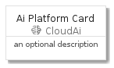
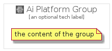

# AiPlatform


```text
gcp/Item/CloudAi/AiPlatform
```

```text
include('gcp/Item/CloudAi/AiPlatform')
```


| Illustration | AiPlatform | AiPlatformCard | AiPlatformGroup |
| :---: | :---: | :---: | :---: |
|  |  |  |  |


## AiPlatform

### Load remotely
```plantuml
@startuml
' configures the library
!global $LIB_BASE_LOCATION="https://raw.githubusercontent.com/tmorin/plantuml-libs/master/distribution"

' loads the library's bootstrap
!include $LIB_BASE_LOCATION/bootstrap.puml

' loads the package bootstrap
include('gcp/bootstrap')

' loads the Item which embeds the element AiPlatform
include('gcp/Item/CloudAi/AiPlatform')

' renders the element
AiPlatform('AiPlatform', 'Ai Platform', 'an optional tech label')
@enduml
```

### Load locally
```plantuml
@startuml
' configures the library
!global $INCLUSION_MODE="local"
!global $LIB_BASE_LOCATION="../../.."

' loads the library's bootstrap
!include $LIB_BASE_LOCATION/bootstrap.puml

' loads the package bootstrap
include('gcp/bootstrap')

' loads the Item which embeds the element AiPlatform
include('gcp/Item/CloudAi/AiPlatform')

' renders the element
AiPlatform('AiPlatform', 'Ai Platform', 'an optional tech label')
@enduml
```

## AiPlatformCard

### Load remotely
```plantuml
@startuml
' configures the library
!global $LIB_BASE_LOCATION="https://raw.githubusercontent.com/tmorin/plantuml-libs/master/distribution"

' loads the library's bootstrap
!include $LIB_BASE_LOCATION/bootstrap.puml

' loads the package bootstrap
include('gcp/bootstrap')

' loads the Item which embeds the element AiPlatformCard
include('gcp/Item/CloudAi/AiPlatform')

' renders the element
AiPlatformCard('AiPlatformCard', 'Ai Platform Card', 'an optional description')
@enduml
```

### Load locally
```plantuml
@startuml
' configures the library
!global $INCLUSION_MODE="local"
!global $LIB_BASE_LOCATION="../../.."

' loads the library's bootstrap
!include $LIB_BASE_LOCATION/bootstrap.puml

' loads the package bootstrap
include('gcp/bootstrap')

' loads the Item which embeds the element AiPlatformCard
include('gcp/Item/CloudAi/AiPlatform')

' renders the element
AiPlatformCard('AiPlatformCard', 'Ai Platform Card', 'an optional description')
@enduml
```

## AiPlatformGroup

### Load remotely
```plantuml
@startuml
' configures the library
!global $LIB_BASE_LOCATION="https://raw.githubusercontent.com/tmorin/plantuml-libs/master/distribution"

' loads the library's bootstrap
!include $LIB_BASE_LOCATION/bootstrap.puml

' loads the package bootstrap
include('gcp/bootstrap')

' loads the Item which embeds the element AiPlatformGroup
include('gcp/Item/CloudAi/AiPlatform')

' renders the element
AiPlatformGroup('AiPlatformGroup', 'Ai Platform Group', 'an optional tech label') {
    note as note
        the content of the group
    end note
}
@enduml
```

### Load locally
```plantuml
@startuml
' configures the library
!global $INCLUSION_MODE="local"
!global $LIB_BASE_LOCATION="../../.."

' loads the library's bootstrap
!include $LIB_BASE_LOCATION/bootstrap.puml

' loads the package bootstrap
include('gcp/bootstrap')

' loads the Item which embeds the element AiPlatformGroup
include('gcp/Item/CloudAi/AiPlatform')

' renders the element
AiPlatformGroup('AiPlatformGroup', 'Ai Platform Group', 'an optional tech label') {
    note as note
        the content of the group
    end note
}
@enduml
```

