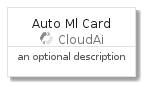
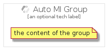

# AutoMl


```text
gcp/Item/CloudAi/AutoMl
```

```text
include('gcp/Item/CloudAi/AutoMl')
```


| Illustration | AutoMl | AutoMlCard | AutoMlGroup |
| :---: | :---: | :---: | :---: |
|  |  |  |  |


## AutoMl

### Load remotely
```plantuml
@startuml
' configures the library
!global $LIB_BASE_LOCATION="https://github.com/tmorin/plantuml-libs/distribution"

' loads the library's bootstrap
!include $LIB_BASE_LOCATION/bootstrap.puml

' loads the package bootstrap
include('gcp/bootstrap')

' loads the Item which embeds the element AutoMl
include('gcp/Item/CloudAi/AutoMl')

' renders the element
AutoMl('AutoMl', 'Auto Ml', 'an optional tech label')
@enduml
```

### Load locally
```plantuml
@startuml
' configures the library
!global $INCLUSION_MODE="local"
!global $LIB_BASE_LOCATION="../../.."

' loads the library's bootstrap
!include $LIB_BASE_LOCATION/bootstrap.puml

' loads the package bootstrap
include('gcp/bootstrap')

' loads the Item which embeds the element AutoMl
include('gcp/Item/CloudAi/AutoMl')

' renders the element
AutoMl('AutoMl', 'Auto Ml', 'an optional tech label')
@enduml
```

## AutoMlCard

### Load remotely
```plantuml
@startuml
' configures the library
!global $LIB_BASE_LOCATION="https://github.com/tmorin/plantuml-libs/distribution"

' loads the library's bootstrap
!include $LIB_BASE_LOCATION/bootstrap.puml

' loads the package bootstrap
include('gcp/bootstrap')

' loads the Item which embeds the element AutoMlCard
include('gcp/Item/CloudAi/AutoMl')

' renders the element
AutoMlCard('AutoMlCard', 'Auto Ml Card', 'an optional description')
@enduml
```

### Load locally
```plantuml
@startuml
' configures the library
!global $INCLUSION_MODE="local"
!global $LIB_BASE_LOCATION="../../.."

' loads the library's bootstrap
!include $LIB_BASE_LOCATION/bootstrap.puml

' loads the package bootstrap
include('gcp/bootstrap')

' loads the Item which embeds the element AutoMlCard
include('gcp/Item/CloudAi/AutoMl')

' renders the element
AutoMlCard('AutoMlCard', 'Auto Ml Card', 'an optional description')
@enduml
```

## AutoMlGroup

### Load remotely
```plantuml
@startuml
' configures the library
!global $LIB_BASE_LOCATION="https://github.com/tmorin/plantuml-libs/distribution"

' loads the library's bootstrap
!include $LIB_BASE_LOCATION/bootstrap.puml

' loads the package bootstrap
include('gcp/bootstrap')

' loads the Item which embeds the element AutoMlGroup
include('gcp/Item/CloudAi/AutoMl')

' renders the element
AutoMlGroup('AutoMlGroup', 'Auto Ml Group', 'an optional tech label') {
    note as note
        the content of the group
    end note
}
@enduml
```

### Load locally
```plantuml
@startuml
' configures the library
!global $INCLUSION_MODE="local"
!global $LIB_BASE_LOCATION="../../.."

' loads the library's bootstrap
!include $LIB_BASE_LOCATION/bootstrap.puml

' loads the package bootstrap
include('gcp/bootstrap')

' loads the Item which embeds the element AutoMlGroup
include('gcp/Item/CloudAi/AutoMl')

' renders the element
AutoMlGroup('AutoMlGroup', 'Auto Ml Group', 'an optional tech label') {
    note as note
        the content of the group
    end note
}
@enduml
```

