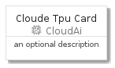
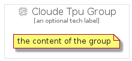

# CloudeTpu


```text
gcp/Item/CloudAi/CloudeTpu
```

```text
include('gcp/Item/CloudAi/CloudeTpu')
```


| Illustration | CloudeTpu | CloudeTpuCard | CloudeTpuGroup |
| :---: | :---: | :---: | :---: |
|  |  |  |  |


## CloudeTpu

### Load remotely
```plantuml
@startuml
' configures the library
!global $LIB_BASE_LOCATION="https://raw.githubusercontent.com/tmorin/plantuml-libs/master/distribution"

' loads the library's bootstrap
!include $LIB_BASE_LOCATION/bootstrap.puml

' loads the package bootstrap
include('gcp/bootstrap')

' loads the Item which embeds the element CloudeTpu
include('gcp/Item/CloudAi/CloudeTpu')

' renders the element
CloudeTpu('CloudeTpu', 'Cloude Tpu', 'an optional tech label')
@enduml
```

### Load locally
```plantuml
@startuml
' configures the library
!global $INCLUSION_MODE="local"
!global $LIB_BASE_LOCATION="../../.."

' loads the library's bootstrap
!include $LIB_BASE_LOCATION/bootstrap.puml

' loads the package bootstrap
include('gcp/bootstrap')

' loads the Item which embeds the element CloudeTpu
include('gcp/Item/CloudAi/CloudeTpu')

' renders the element
CloudeTpu('CloudeTpu', 'Cloude Tpu', 'an optional tech label')
@enduml
```

## CloudeTpuCard

### Load remotely
```plantuml
@startuml
' configures the library
!global $LIB_BASE_LOCATION="https://raw.githubusercontent.com/tmorin/plantuml-libs/master/distribution"

' loads the library's bootstrap
!include $LIB_BASE_LOCATION/bootstrap.puml

' loads the package bootstrap
include('gcp/bootstrap')

' loads the Item which embeds the element CloudeTpuCard
include('gcp/Item/CloudAi/CloudeTpu')

' renders the element
CloudeTpuCard('CloudeTpuCard', 'Cloude Tpu Card', 'an optional description')
@enduml
```

### Load locally
```plantuml
@startuml
' configures the library
!global $INCLUSION_MODE="local"
!global $LIB_BASE_LOCATION="../../.."

' loads the library's bootstrap
!include $LIB_BASE_LOCATION/bootstrap.puml

' loads the package bootstrap
include('gcp/bootstrap')

' loads the Item which embeds the element CloudeTpuCard
include('gcp/Item/CloudAi/CloudeTpu')

' renders the element
CloudeTpuCard('CloudeTpuCard', 'Cloude Tpu Card', 'an optional description')
@enduml
```

## CloudeTpuGroup

### Load remotely
```plantuml
@startuml
' configures the library
!global $LIB_BASE_LOCATION="https://raw.githubusercontent.com/tmorin/plantuml-libs/master/distribution"

' loads the library's bootstrap
!include $LIB_BASE_LOCATION/bootstrap.puml

' loads the package bootstrap
include('gcp/bootstrap')

' loads the Item which embeds the element CloudeTpuGroup
include('gcp/Item/CloudAi/CloudeTpu')

' renders the element
CloudeTpuGroup('CloudeTpuGroup', 'Cloude Tpu Group', 'an optional tech label') {
    note as note
        the content of the group
    end note
}
@enduml
```

### Load locally
```plantuml
@startuml
' configures the library
!global $INCLUSION_MODE="local"
!global $LIB_BASE_LOCATION="../../.."

' loads the library's bootstrap
!include $LIB_BASE_LOCATION/bootstrap.puml

' loads the package bootstrap
include('gcp/bootstrap')

' loads the Item which embeds the element CloudeTpuGroup
include('gcp/Item/CloudAi/CloudeTpu')

' renders the element
CloudeTpuGroup('CloudeTpuGroup', 'Cloude Tpu Group', 'an optional tech label') {
    note as note
        the content of the group
    end note
}
@enduml
```

