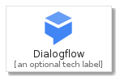
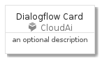
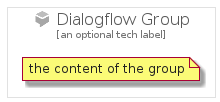

# Dialogflow


```text
gcp/Item/CloudAi/Dialogflow
```

```text
include('gcp/Item/CloudAi/Dialogflow')
```


| Illustration | Dialogflow | DialogflowCard | DialogflowGroup |
| :---: | :---: | :---: | :---: |
|  |  |  |  |


## Dialogflow

### Load remotely
```plantuml
@startuml
' configures the library
!global $LIB_BASE_LOCATION="https://github.com/tmorin/plantuml-libs/distribution"

' loads the library's bootstrap
!include $LIB_BASE_LOCATION/bootstrap.puml

' loads the package bootstrap
include('gcp/bootstrap')

' loads the Item which embeds the element Dialogflow
include('gcp/Item/CloudAi/Dialogflow')

' renders the element
Dialogflow('Dialogflow', 'Dialogflow', 'an optional tech label')
@enduml
```

### Load locally
```plantuml
@startuml
' configures the library
!global $INCLUSION_MODE="local"
!global $LIB_BASE_LOCATION="../../.."

' loads the library's bootstrap
!include $LIB_BASE_LOCATION/bootstrap.puml

' loads the package bootstrap
include('gcp/bootstrap')

' loads the Item which embeds the element Dialogflow
include('gcp/Item/CloudAi/Dialogflow')

' renders the element
Dialogflow('Dialogflow', 'Dialogflow', 'an optional tech label')
@enduml
```

## DialogflowCard

### Load remotely
```plantuml
@startuml
' configures the library
!global $LIB_BASE_LOCATION="https://github.com/tmorin/plantuml-libs/distribution"

' loads the library's bootstrap
!include $LIB_BASE_LOCATION/bootstrap.puml

' loads the package bootstrap
include('gcp/bootstrap')

' loads the Item which embeds the element DialogflowCard
include('gcp/Item/CloudAi/Dialogflow')

' renders the element
DialogflowCard('DialogflowCard', 'Dialogflow Card', 'an optional description')
@enduml
```

### Load locally
```plantuml
@startuml
' configures the library
!global $INCLUSION_MODE="local"
!global $LIB_BASE_LOCATION="../../.."

' loads the library's bootstrap
!include $LIB_BASE_LOCATION/bootstrap.puml

' loads the package bootstrap
include('gcp/bootstrap')

' loads the Item which embeds the element DialogflowCard
include('gcp/Item/CloudAi/Dialogflow')

' renders the element
DialogflowCard('DialogflowCard', 'Dialogflow Card', 'an optional description')
@enduml
```

## DialogflowGroup

### Load remotely
```plantuml
@startuml
' configures the library
!global $LIB_BASE_LOCATION="https://github.com/tmorin/plantuml-libs/distribution"

' loads the library's bootstrap
!include $LIB_BASE_LOCATION/bootstrap.puml

' loads the package bootstrap
include('gcp/bootstrap')

' loads the Item which embeds the element DialogflowGroup
include('gcp/Item/CloudAi/Dialogflow')

' renders the element
DialogflowGroup('DialogflowGroup', 'Dialogflow Group', 'an optional tech label') {
    note as note
        the content of the group
    end note
}
@enduml
```

### Load locally
```plantuml
@startuml
' configures the library
!global $INCLUSION_MODE="local"
!global $LIB_BASE_LOCATION="../../.."

' loads the library's bootstrap
!include $LIB_BASE_LOCATION/bootstrap.puml

' loads the package bootstrap
include('gcp/bootstrap')

' loads the Item which embeds the element DialogflowGroup
include('gcp/Item/CloudAi/Dialogflow')

' renders the element
DialogflowGroup('DialogflowGroup', 'Dialogflow Group', 'an optional tech label') {
    note as note
        the content of the group
    end note
}
@enduml
```

