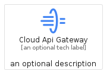
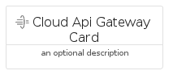
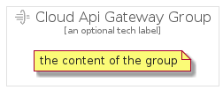

# CloudApiGateway


```text
gcp/Item/CloudApiGateway
```

```text
include('gcp/Item/CloudApiGateway')
```


| Illustration | CloudApiGateway | CloudApiGatewayCard | CloudApiGatewayGroup |
| :---: | :---: | :---: | :---: |
|  |  |  |  |


## Sprites
The item provides the following sriptes:

- `<$CloudApiGatewayXs>`
- `<$CloudApiGatewaySm>`
- `<$CloudApiGatewayMd>`
- `<$CloudApiGatewayLg>`


## CloudApiGateway

### Load remotely
```plantuml
@startuml
' configures the library
!global $LIB_BASE_LOCATION="https://raw.githubusercontent.com/tmorin/plantuml-libs/master/distribution"

' loads the library's bootstrap
!include $LIB_BASE_LOCATION/bootstrap.puml

' loads the package bootstrap
include('gcp/bootstrap')

' loads the Item which embeds the element CloudApiGateway
include('gcp/Item/CloudApiGateway')

' renders the element
CloudApiGateway('CloudApiGateway', 'Cloud Api Gateway', 'an optional tech label', 'an optional description')
@enduml
```

### Load locally
```plantuml
@startuml
' configures the library
!global $INCLUSION_MODE="local"
!global $LIB_BASE_LOCATION="../.."

' loads the library's bootstrap
!include $LIB_BASE_LOCATION/bootstrap.puml

' loads the package bootstrap
include('gcp/bootstrap')

' loads the Item which embeds the element CloudApiGateway
include('gcp/Item/CloudApiGateway')

' renders the element
CloudApiGateway('CloudApiGateway', 'Cloud Api Gateway', 'an optional tech label', 'an optional description')
@enduml
```

## CloudApiGatewayCard

### Load remotely
```plantuml
@startuml
' configures the library
!global $LIB_BASE_LOCATION="https://raw.githubusercontent.com/tmorin/plantuml-libs/master/distribution"

' loads the library's bootstrap
!include $LIB_BASE_LOCATION/bootstrap.puml

' loads the package bootstrap
include('gcp/bootstrap')

' loads the Item which embeds the element CloudApiGatewayCard
include('gcp/Item/CloudApiGateway')

' renders the element
CloudApiGatewayCard('CloudApiGatewayCard', 'Cloud Api Gateway Card', 'an optional description')
@enduml
```

### Load locally
```plantuml
@startuml
' configures the library
!global $INCLUSION_MODE="local"
!global $LIB_BASE_LOCATION="../.."

' loads the library's bootstrap
!include $LIB_BASE_LOCATION/bootstrap.puml

' loads the package bootstrap
include('gcp/bootstrap')

' loads the Item which embeds the element CloudApiGatewayCard
include('gcp/Item/CloudApiGateway')

' renders the element
CloudApiGatewayCard('CloudApiGatewayCard', 'Cloud Api Gateway Card', 'an optional description')
@enduml
```

## CloudApiGatewayGroup

### Load remotely
```plantuml
@startuml
' configures the library
!global $LIB_BASE_LOCATION="https://raw.githubusercontent.com/tmorin/plantuml-libs/master/distribution"

' loads the library's bootstrap
!include $LIB_BASE_LOCATION/bootstrap.puml

' loads the package bootstrap
include('gcp/bootstrap')

' loads the Item which embeds the element CloudApiGatewayGroup
include('gcp/Item/CloudApiGateway')

' renders the element
CloudApiGatewayGroup('CloudApiGatewayGroup', 'Cloud Api Gateway Group', 'an optional tech label') {
    note as note
        the content of the group
    end note
}
@enduml
```

### Load locally
```plantuml
@startuml
' configures the library
!global $INCLUSION_MODE="local"
!global $LIB_BASE_LOCATION="../.."

' loads the library's bootstrap
!include $LIB_BASE_LOCATION/bootstrap.puml

' loads the package bootstrap
include('gcp/bootstrap')

' loads the Item which embeds the element CloudApiGatewayGroup
include('gcp/Item/CloudApiGateway')

' renders the element
CloudApiGatewayGroup('CloudApiGatewayGroup', 'Cloud Api Gateway Group', 'an optional tech label') {
    note as note
        the content of the group
    end note
}
@enduml
```

