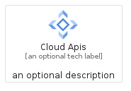
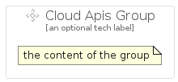

# CloudApis


```text
gcp/Item/CloudApis
```

```text
include('gcp/Item/CloudApis')
```


| Illustration | CloudApis | CloudApisCard | CloudApisGroup |
| :---: | :---: | :---: | :---: |
|  |  |  |  |


## CloudApis

### Load remotely
```plantuml
@startuml
' configures the library
!global $LIB_BASE_LOCATION="https://raw.githubusercontent.com/tmorin/plantuml-libs/master/distribution"

' loads the library's bootstrap
!include $LIB_BASE_LOCATION/bootstrap.puml

' loads the package bootstrap
include('gcp/bootstrap')

' loads the Item which embeds the element CloudApis
include('gcp/Item/CloudApis')

' renders the element
CloudApis('CloudApis', 'Cloud Apis', 'an optional tech label')
@enduml
```

### Load locally
```plantuml
@startuml
' configures the library
!global $INCLUSION_MODE="local"
!global $LIB_BASE_LOCATION="../.."

' loads the library's bootstrap
!include $LIB_BASE_LOCATION/bootstrap.puml

' loads the package bootstrap
include('gcp/bootstrap')

' loads the Item which embeds the element CloudApis
include('gcp/Item/CloudApis')

' renders the element
CloudApis('CloudApis', 'Cloud Apis', 'an optional tech label')
@enduml
```

## CloudApisCard

### Load remotely
```plantuml
@startuml
' configures the library
!global $LIB_BASE_LOCATION="https://raw.githubusercontent.com/tmorin/plantuml-libs/master/distribution"

' loads the library's bootstrap
!include $LIB_BASE_LOCATION/bootstrap.puml

' loads the package bootstrap
include('gcp/bootstrap')

' loads the Item which embeds the element CloudApisCard
include('gcp/Item/CloudApis')

' renders the element
CloudApisCard('CloudApisCard', 'Cloud Apis Card', 'an optional description')
@enduml
```

### Load locally
```plantuml
@startuml
' configures the library
!global $INCLUSION_MODE="local"
!global $LIB_BASE_LOCATION="../.."

' loads the library's bootstrap
!include $LIB_BASE_LOCATION/bootstrap.puml

' loads the package bootstrap
include('gcp/bootstrap')

' loads the Item which embeds the element CloudApisCard
include('gcp/Item/CloudApis')

' renders the element
CloudApisCard('CloudApisCard', 'Cloud Apis Card', 'an optional description')
@enduml
```

## CloudApisGroup

### Load remotely
```plantuml
@startuml
' configures the library
!global $LIB_BASE_LOCATION="https://raw.githubusercontent.com/tmorin/plantuml-libs/master/distribution"

' loads the library's bootstrap
!include $LIB_BASE_LOCATION/bootstrap.puml

' loads the package bootstrap
include('gcp/bootstrap')

' loads the Item which embeds the element CloudApisGroup
include('gcp/Item/CloudApis')

' renders the element
CloudApisGroup('CloudApisGroup', 'Cloud Apis Group', 'an optional tech label') {
    note as note
        the content of the group
    end note
}
@enduml
```

### Load locally
```plantuml
@startuml
' configures the library
!global $INCLUSION_MODE="local"
!global $LIB_BASE_LOCATION="../.."

' loads the library's bootstrap
!include $LIB_BASE_LOCATION/bootstrap.puml

' loads the package bootstrap
include('gcp/bootstrap')

' loads the Item which embeds the element CloudApisGroup
include('gcp/Item/CloudApis')

' renders the element
CloudApisGroup('CloudApisGroup', 'Cloud Apis Group', 'an optional tech label') {
    note as note
        the content of the group
    end note
}
@enduml
```

