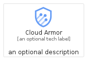
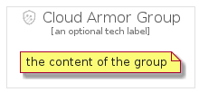

# CloudArmor


```text
gcp/Item/CloudArmor
```

```text
include('gcp/Item/CloudArmor')
```


| Illustration | CloudArmor | CloudArmorCard | CloudArmorGroup |
| :---: | :---: | :---: | :---: |
|  |  |  |  |


## Sprites
The item provides the following sriptes:

- `<$CloudArmorXs>`
- `<$CloudArmorSm>`
- `<$CloudArmorMd>`
- `<$CloudArmorLg>`


## CloudArmor

### Load remotely
```plantuml
@startuml
' configures the library
!global $LIB_BASE_LOCATION="https://raw.githubusercontent.com/tmorin/plantuml-libs/master/distribution"

' loads the library's bootstrap
!include $LIB_BASE_LOCATION/bootstrap.puml

' loads the package bootstrap
include('gcp/bootstrap')

' loads the Item which embeds the element CloudArmor
include('gcp/Item/CloudArmor')

' renders the element
CloudArmor('CloudArmor', 'Cloud Armor', 'an optional tech label', 'an optional description')
@enduml
```

### Load locally
```plantuml
@startuml
' configures the library
!global $INCLUSION_MODE="local"
!global $LIB_BASE_LOCATION="../.."

' loads the library's bootstrap
!include $LIB_BASE_LOCATION/bootstrap.puml

' loads the package bootstrap
include('gcp/bootstrap')

' loads the Item which embeds the element CloudArmor
include('gcp/Item/CloudArmor')

' renders the element
CloudArmor('CloudArmor', 'Cloud Armor', 'an optional tech label', 'an optional description')
@enduml
```

## CloudArmorCard

### Load remotely
```plantuml
@startuml
' configures the library
!global $LIB_BASE_LOCATION="https://raw.githubusercontent.com/tmorin/plantuml-libs/master/distribution"

' loads the library's bootstrap
!include $LIB_BASE_LOCATION/bootstrap.puml

' loads the package bootstrap
include('gcp/bootstrap')

' loads the Item which embeds the element CloudArmorCard
include('gcp/Item/CloudArmor')

' renders the element
CloudArmorCard('CloudArmorCard', 'Cloud Armor Card', 'an optional description')
@enduml
```

### Load locally
```plantuml
@startuml
' configures the library
!global $INCLUSION_MODE="local"
!global $LIB_BASE_LOCATION="../.."

' loads the library's bootstrap
!include $LIB_BASE_LOCATION/bootstrap.puml

' loads the package bootstrap
include('gcp/bootstrap')

' loads the Item which embeds the element CloudArmorCard
include('gcp/Item/CloudArmor')

' renders the element
CloudArmorCard('CloudArmorCard', 'Cloud Armor Card', 'an optional description')
@enduml
```

## CloudArmorGroup

### Load remotely
```plantuml
@startuml
' configures the library
!global $LIB_BASE_LOCATION="https://raw.githubusercontent.com/tmorin/plantuml-libs/master/distribution"

' loads the library's bootstrap
!include $LIB_BASE_LOCATION/bootstrap.puml

' loads the package bootstrap
include('gcp/bootstrap')

' loads the Item which embeds the element CloudArmorGroup
include('gcp/Item/CloudArmor')

' renders the element
CloudArmorGroup('CloudArmorGroup', 'Cloud Armor Group', 'an optional tech label') {
    note as note
        the content of the group
    end note
}
@enduml
```

### Load locally
```plantuml
@startuml
' configures the library
!global $INCLUSION_MODE="local"
!global $LIB_BASE_LOCATION="../.."

' loads the library's bootstrap
!include $LIB_BASE_LOCATION/bootstrap.puml

' loads the package bootstrap
include('gcp/bootstrap')

' loads the Item which embeds the element CloudArmorGroup
include('gcp/Item/CloudArmor')

' renders the element
CloudArmorGroup('CloudArmorGroup', 'Cloud Armor Group', 'an optional tech label') {
    note as note
        the content of the group
    end note
}
@enduml
```

