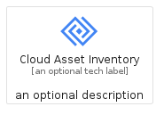
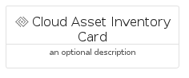
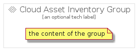

# CloudAssetInventory


```text
gcp/Item/CloudAssetInventory
```

```text
include('gcp/Item/CloudAssetInventory')
```


| Illustration | CloudAssetInventory | CloudAssetInventoryCard | CloudAssetInventoryGroup |
| :---: | :---: | :---: | :---: |
|  |  |  |  |


## CloudAssetInventory

### Load remotely
```plantuml
@startuml
' configures the library
!global $LIB_BASE_LOCATION="https://raw.githubusercontent.com/tmorin/plantuml-libs/master/distribution"

' loads the library's bootstrap
!include $LIB_BASE_LOCATION/bootstrap.puml

' loads the package bootstrap
include('gcp/bootstrap')

' loads the Item which embeds the element CloudAssetInventory
include('gcp/Item/CloudAssetInventory')

' renders the element
CloudAssetInventory('CloudAssetInventory', 'Cloud Asset Inventory', 'an optional tech label', 'an optional description')
@enduml
```

### Load locally
```plantuml
@startuml
' configures the library
!global $INCLUSION_MODE="local"
!global $LIB_BASE_LOCATION="../.."

' loads the library's bootstrap
!include $LIB_BASE_LOCATION/bootstrap.puml

' loads the package bootstrap
include('gcp/bootstrap')

' loads the Item which embeds the element CloudAssetInventory
include('gcp/Item/CloudAssetInventory')

' renders the element
CloudAssetInventory('CloudAssetInventory', 'Cloud Asset Inventory', 'an optional tech label', 'an optional description')
@enduml
```

## CloudAssetInventoryCard

### Load remotely
```plantuml
@startuml
' configures the library
!global $LIB_BASE_LOCATION="https://raw.githubusercontent.com/tmorin/plantuml-libs/master/distribution"

' loads the library's bootstrap
!include $LIB_BASE_LOCATION/bootstrap.puml

' loads the package bootstrap
include('gcp/bootstrap')

' loads the Item which embeds the element CloudAssetInventoryCard
include('gcp/Item/CloudAssetInventory')

' renders the element
CloudAssetInventoryCard('CloudAssetInventoryCard', 'Cloud Asset Inventory Card', 'an optional description')
@enduml
```

### Load locally
```plantuml
@startuml
' configures the library
!global $INCLUSION_MODE="local"
!global $LIB_BASE_LOCATION="../.."

' loads the library's bootstrap
!include $LIB_BASE_LOCATION/bootstrap.puml

' loads the package bootstrap
include('gcp/bootstrap')

' loads the Item which embeds the element CloudAssetInventoryCard
include('gcp/Item/CloudAssetInventory')

' renders the element
CloudAssetInventoryCard('CloudAssetInventoryCard', 'Cloud Asset Inventory Card', 'an optional description')
@enduml
```

## CloudAssetInventoryGroup

### Load remotely
```plantuml
@startuml
' configures the library
!global $LIB_BASE_LOCATION="https://raw.githubusercontent.com/tmorin/plantuml-libs/master/distribution"

' loads the library's bootstrap
!include $LIB_BASE_LOCATION/bootstrap.puml

' loads the package bootstrap
include('gcp/bootstrap')

' loads the Item which embeds the element CloudAssetInventoryGroup
include('gcp/Item/CloudAssetInventory')

' renders the element
CloudAssetInventoryGroup('CloudAssetInventoryGroup', 'Cloud Asset Inventory Group', 'an optional tech label') {
    note as note
        the content of the group
    end note
}
@enduml
```

### Load locally
```plantuml
@startuml
' configures the library
!global $INCLUSION_MODE="local"
!global $LIB_BASE_LOCATION="../.."

' loads the library's bootstrap
!include $LIB_BASE_LOCATION/bootstrap.puml

' loads the package bootstrap
include('gcp/bootstrap')

' loads the Item which embeds the element CloudAssetInventoryGroup
include('gcp/Item/CloudAssetInventory')

' renders the element
CloudAssetInventoryGroup('CloudAssetInventoryGroup', 'Cloud Asset Inventory Group', 'an optional tech label') {
    note as note
        the content of the group
    end note
}
@enduml
```

