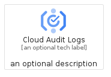
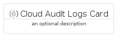

# CloudAuditLogs


```text
gcp/Item/CloudAuditLogs
```

```text
include('gcp/Item/CloudAuditLogs')
```


| Illustration | CloudAuditLogs | CloudAuditLogsCard | CloudAuditLogsGroup |
| :---: | :---: | :---: | :---: |
|  |  |  |  |


## CloudAuditLogs

### Load remotely
```plantuml
@startuml
' configures the library
!global $LIB_BASE_LOCATION="https://raw.githubusercontent.com/tmorin/plantuml-libs/master/distribution"

' loads the library's bootstrap
!include $LIB_BASE_LOCATION/bootstrap.puml

' loads the package bootstrap
include('gcp/bootstrap')

' loads the Item which embeds the element CloudAuditLogs
include('gcp/Item/CloudAuditLogs')

' renders the element
CloudAuditLogs('CloudAuditLogs', 'Cloud Audit Logs', 'an optional tech label', 'an optional description')
@enduml
```

### Load locally
```plantuml
@startuml
' configures the library
!global $INCLUSION_MODE="local"
!global $LIB_BASE_LOCATION="../.."

' loads the library's bootstrap
!include $LIB_BASE_LOCATION/bootstrap.puml

' loads the package bootstrap
include('gcp/bootstrap')

' loads the Item which embeds the element CloudAuditLogs
include('gcp/Item/CloudAuditLogs')

' renders the element
CloudAuditLogs('CloudAuditLogs', 'Cloud Audit Logs', 'an optional tech label', 'an optional description')
@enduml
```

## CloudAuditLogsCard

### Load remotely
```plantuml
@startuml
' configures the library
!global $LIB_BASE_LOCATION="https://raw.githubusercontent.com/tmorin/plantuml-libs/master/distribution"

' loads the library's bootstrap
!include $LIB_BASE_LOCATION/bootstrap.puml

' loads the package bootstrap
include('gcp/bootstrap')

' loads the Item which embeds the element CloudAuditLogsCard
include('gcp/Item/CloudAuditLogs')

' renders the element
CloudAuditLogsCard('CloudAuditLogsCard', 'Cloud Audit Logs Card', 'an optional description')
@enduml
```

### Load locally
```plantuml
@startuml
' configures the library
!global $INCLUSION_MODE="local"
!global $LIB_BASE_LOCATION="../.."

' loads the library's bootstrap
!include $LIB_BASE_LOCATION/bootstrap.puml

' loads the package bootstrap
include('gcp/bootstrap')

' loads the Item which embeds the element CloudAuditLogsCard
include('gcp/Item/CloudAuditLogs')

' renders the element
CloudAuditLogsCard('CloudAuditLogsCard', 'Cloud Audit Logs Card', 'an optional description')
@enduml
```

## CloudAuditLogsGroup

### Load remotely
```plantuml
@startuml
' configures the library
!global $LIB_BASE_LOCATION="https://raw.githubusercontent.com/tmorin/plantuml-libs/master/distribution"

' loads the library's bootstrap
!include $LIB_BASE_LOCATION/bootstrap.puml

' loads the package bootstrap
include('gcp/bootstrap')

' loads the Item which embeds the element CloudAuditLogsGroup
include('gcp/Item/CloudAuditLogs')

' renders the element
CloudAuditLogsGroup('CloudAuditLogsGroup', 'Cloud Audit Logs Group', 'an optional tech label') {
    note as note
        the content of the group
    end note
}
@enduml
```

### Load locally
```plantuml
@startuml
' configures the library
!global $INCLUSION_MODE="local"
!global $LIB_BASE_LOCATION="../.."

' loads the library's bootstrap
!include $LIB_BASE_LOCATION/bootstrap.puml

' loads the package bootstrap
include('gcp/bootstrap')

' loads the Item which embeds the element CloudAuditLogsGroup
include('gcp/Item/CloudAuditLogs')

' renders the element
CloudAuditLogsGroup('CloudAuditLogsGroup', 'Cloud Audit Logs Group', 'an optional tech label') {
    note as note
        the content of the group
    end note
}
@enduml
```

