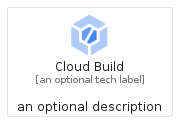
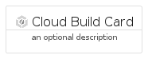
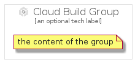

# CloudBuild


```text
gcp/Item/CloudBuild
```

```text
include('gcp/Item/CloudBuild')
```


| Illustration | CloudBuild | CloudBuildCard | CloudBuildGroup |
| :---: | :---: | :---: | :---: |
|  |  |  |  |


## Sprites
The item provides the following sriptes:

- `<$CloudBuildXs>`
- `<$CloudBuildSm>`
- `<$CloudBuildMd>`
- `<$CloudBuildLg>`


## CloudBuild

### Load remotely
```plantuml
@startuml
' configures the library
!global $LIB_BASE_LOCATION="https://raw.githubusercontent.com/tmorin/plantuml-libs/master/distribution"

' loads the library's bootstrap
!include $LIB_BASE_LOCATION/bootstrap.puml

' loads the package bootstrap
include('gcp/bootstrap')

' loads the Item which embeds the element CloudBuild
include('gcp/Item/CloudBuild')

' renders the element
CloudBuild('CloudBuild', 'Cloud Build', 'an optional tech label', 'an optional description')
@enduml
```

### Load locally
```plantuml
@startuml
' configures the library
!global $INCLUSION_MODE="local"
!global $LIB_BASE_LOCATION="../.."

' loads the library's bootstrap
!include $LIB_BASE_LOCATION/bootstrap.puml

' loads the package bootstrap
include('gcp/bootstrap')

' loads the Item which embeds the element CloudBuild
include('gcp/Item/CloudBuild')

' renders the element
CloudBuild('CloudBuild', 'Cloud Build', 'an optional tech label', 'an optional description')
@enduml
```

## CloudBuildCard

### Load remotely
```plantuml
@startuml
' configures the library
!global $LIB_BASE_LOCATION="https://raw.githubusercontent.com/tmorin/plantuml-libs/master/distribution"

' loads the library's bootstrap
!include $LIB_BASE_LOCATION/bootstrap.puml

' loads the package bootstrap
include('gcp/bootstrap')

' loads the Item which embeds the element CloudBuildCard
include('gcp/Item/CloudBuild')

' renders the element
CloudBuildCard('CloudBuildCard', 'Cloud Build Card', 'an optional description')
@enduml
```

### Load locally
```plantuml
@startuml
' configures the library
!global $INCLUSION_MODE="local"
!global $LIB_BASE_LOCATION="../.."

' loads the library's bootstrap
!include $LIB_BASE_LOCATION/bootstrap.puml

' loads the package bootstrap
include('gcp/bootstrap')

' loads the Item which embeds the element CloudBuildCard
include('gcp/Item/CloudBuild')

' renders the element
CloudBuildCard('CloudBuildCard', 'Cloud Build Card', 'an optional description')
@enduml
```

## CloudBuildGroup

### Load remotely
```plantuml
@startuml
' configures the library
!global $LIB_BASE_LOCATION="https://raw.githubusercontent.com/tmorin/plantuml-libs/master/distribution"

' loads the library's bootstrap
!include $LIB_BASE_LOCATION/bootstrap.puml

' loads the package bootstrap
include('gcp/bootstrap')

' loads the Item which embeds the element CloudBuildGroup
include('gcp/Item/CloudBuild')

' renders the element
CloudBuildGroup('CloudBuildGroup', 'Cloud Build Group', 'an optional tech label') {
    note as note
        the content of the group
    end note
}
@enduml
```

### Load locally
```plantuml
@startuml
' configures the library
!global $INCLUSION_MODE="local"
!global $LIB_BASE_LOCATION="../.."

' loads the library's bootstrap
!include $LIB_BASE_LOCATION/bootstrap.puml

' loads the package bootstrap
include('gcp/bootstrap')

' loads the Item which embeds the element CloudBuildGroup
include('gcp/Item/CloudBuild')

' renders the element
CloudBuildGroup('CloudBuildGroup', 'Cloud Build Group', 'an optional tech label') {
    note as note
        the content of the group
    end note
}
@enduml
```

