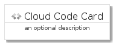

# CloudCode


```text
gcp/Item/CloudCode
```

```text
include('gcp/Item/CloudCode')
```


| Illustration | CloudCode | CloudCodeCard | CloudCodeGroup |
| :---: | :---: | :---: | :---: |
|  |  |  |  |


## CloudCode

### Load remotely
```plantuml
@startuml
' configures the library
!global $LIB_BASE_LOCATION="https://raw.githubusercontent.com/tmorin/plantuml-libs/master/distribution"

' loads the library's bootstrap
!include $LIB_BASE_LOCATION/bootstrap.puml

' loads the package bootstrap
include('gcp/bootstrap')

' loads the Item which embeds the element CloudCode
include('gcp/Item/CloudCode')

' renders the element
CloudCode('CloudCode', 'Cloud Code', 'an optional tech label', 'an optional description')
@enduml
```

### Load locally
```plantuml
@startuml
' configures the library
!global $INCLUSION_MODE="local"
!global $LIB_BASE_LOCATION="../.."

' loads the library's bootstrap
!include $LIB_BASE_LOCATION/bootstrap.puml

' loads the package bootstrap
include('gcp/bootstrap')

' loads the Item which embeds the element CloudCode
include('gcp/Item/CloudCode')

' renders the element
CloudCode('CloudCode', 'Cloud Code', 'an optional tech label', 'an optional description')
@enduml
```

## CloudCodeCard

### Load remotely
```plantuml
@startuml
' configures the library
!global $LIB_BASE_LOCATION="https://raw.githubusercontent.com/tmorin/plantuml-libs/master/distribution"

' loads the library's bootstrap
!include $LIB_BASE_LOCATION/bootstrap.puml

' loads the package bootstrap
include('gcp/bootstrap')

' loads the Item which embeds the element CloudCodeCard
include('gcp/Item/CloudCode')

' renders the element
CloudCodeCard('CloudCodeCard', 'Cloud Code Card', 'an optional description')
@enduml
```

### Load locally
```plantuml
@startuml
' configures the library
!global $INCLUSION_MODE="local"
!global $LIB_BASE_LOCATION="../.."

' loads the library's bootstrap
!include $LIB_BASE_LOCATION/bootstrap.puml

' loads the package bootstrap
include('gcp/bootstrap')

' loads the Item which embeds the element CloudCodeCard
include('gcp/Item/CloudCode')

' renders the element
CloudCodeCard('CloudCodeCard', 'Cloud Code Card', 'an optional description')
@enduml
```

## CloudCodeGroup

### Load remotely
```plantuml
@startuml
' configures the library
!global $LIB_BASE_LOCATION="https://raw.githubusercontent.com/tmorin/plantuml-libs/master/distribution"

' loads the library's bootstrap
!include $LIB_BASE_LOCATION/bootstrap.puml

' loads the package bootstrap
include('gcp/bootstrap')

' loads the Item which embeds the element CloudCodeGroup
include('gcp/Item/CloudCode')

' renders the element
CloudCodeGroup('CloudCodeGroup', 'Cloud Code Group', 'an optional tech label') {
    note as note
        the content of the group
    end note
}
@enduml
```

### Load locally
```plantuml
@startuml
' configures the library
!global $INCLUSION_MODE="local"
!global $LIB_BASE_LOCATION="../.."

' loads the library's bootstrap
!include $LIB_BASE_LOCATION/bootstrap.puml

' loads the package bootstrap
include('gcp/bootstrap')

' loads the Item which embeds the element CloudCodeGroup
include('gcp/Item/CloudCode')

' renders the element
CloudCodeGroup('CloudCodeGroup', 'Cloud Code Group', 'an optional tech label') {
    note as note
        the content of the group
    end note
}
@enduml
```

