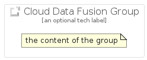

# CloudDataFusion


```text
gcp/Item/CloudDataFusion
```

```text
include('gcp/Item/CloudDataFusion')
```


| Illustration | CloudDataFusion | CloudDataFusionCard | CloudDataFusionGroup |
| :---: | :---: | :---: | :---: |
|  |  |  |  |


## Sprites
The item provides the following sriptes:

- `<$CloudDataFusionXs>`
- `<$CloudDataFusionSm>`
- `<$CloudDataFusionMd>`
- `<$CloudDataFusionLg>`


## CloudDataFusion

### Load remotely
```plantuml
@startuml
' configures the library
!global $LIB_BASE_LOCATION="https://raw.githubusercontent.com/tmorin/plantuml-libs/master/distribution"

' loads the library's bootstrap
!include $LIB_BASE_LOCATION/bootstrap.puml

' loads the package bootstrap
include('gcp/bootstrap')

' loads the Item which embeds the element CloudDataFusion
include('gcp/Item/CloudDataFusion')

' renders the element
CloudDataFusion('CloudDataFusion', 'Cloud Data Fusion', 'an optional tech label', 'an optional description')
@enduml
```

### Load locally
```plantuml
@startuml
' configures the library
!global $INCLUSION_MODE="local"
!global $LIB_BASE_LOCATION="../.."

' loads the library's bootstrap
!include $LIB_BASE_LOCATION/bootstrap.puml

' loads the package bootstrap
include('gcp/bootstrap')

' loads the Item which embeds the element CloudDataFusion
include('gcp/Item/CloudDataFusion')

' renders the element
CloudDataFusion('CloudDataFusion', 'Cloud Data Fusion', 'an optional tech label', 'an optional description')
@enduml
```

## CloudDataFusionCard

### Load remotely
```plantuml
@startuml
' configures the library
!global $LIB_BASE_LOCATION="https://raw.githubusercontent.com/tmorin/plantuml-libs/master/distribution"

' loads the library's bootstrap
!include $LIB_BASE_LOCATION/bootstrap.puml

' loads the package bootstrap
include('gcp/bootstrap')

' loads the Item which embeds the element CloudDataFusionCard
include('gcp/Item/CloudDataFusion')

' renders the element
CloudDataFusionCard('CloudDataFusionCard', 'Cloud Data Fusion Card', 'an optional description')
@enduml
```

### Load locally
```plantuml
@startuml
' configures the library
!global $INCLUSION_MODE="local"
!global $LIB_BASE_LOCATION="../.."

' loads the library's bootstrap
!include $LIB_BASE_LOCATION/bootstrap.puml

' loads the package bootstrap
include('gcp/bootstrap')

' loads the Item which embeds the element CloudDataFusionCard
include('gcp/Item/CloudDataFusion')

' renders the element
CloudDataFusionCard('CloudDataFusionCard', 'Cloud Data Fusion Card', 'an optional description')
@enduml
```

## CloudDataFusionGroup

### Load remotely
```plantuml
@startuml
' configures the library
!global $LIB_BASE_LOCATION="https://raw.githubusercontent.com/tmorin/plantuml-libs/master/distribution"

' loads the library's bootstrap
!include $LIB_BASE_LOCATION/bootstrap.puml

' loads the package bootstrap
include('gcp/bootstrap')

' loads the Item which embeds the element CloudDataFusionGroup
include('gcp/Item/CloudDataFusion')

' renders the element
CloudDataFusionGroup('CloudDataFusionGroup', 'Cloud Data Fusion Group', 'an optional tech label') {
    note as note
        the content of the group
    end note
}
@enduml
```

### Load locally
```plantuml
@startuml
' configures the library
!global $INCLUSION_MODE="local"
!global $LIB_BASE_LOCATION="../.."

' loads the library's bootstrap
!include $LIB_BASE_LOCATION/bootstrap.puml

' loads the package bootstrap
include('gcp/bootstrap')

' loads the Item which embeds the element CloudDataFusionGroup
include('gcp/Item/CloudDataFusion')

' renders the element
CloudDataFusionGroup('CloudDataFusionGroup', 'Cloud Data Fusion Group', 'an optional tech label') {
    note as note
        the content of the group
    end note
}
@enduml
```

