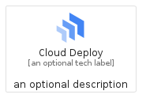
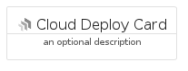
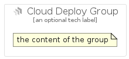

# CloudDeploy


```text
gcp/Item/CloudDeploy
```

```text
include('gcp/Item/CloudDeploy')
```


| Illustration | CloudDeploy | CloudDeployCard | CloudDeployGroup |
| :---: | :---: | :---: | :---: |
|  |  |  |  |


## Sprites
The item provides the following sriptes:

- `<$CloudDeployXs>`
- `<$CloudDeploySm>`
- `<$CloudDeployMd>`
- `<$CloudDeployLg>`


## CloudDeploy

### Load remotely
```plantuml
@startuml
' configures the library
!global $LIB_BASE_LOCATION="https://raw.githubusercontent.com/tmorin/plantuml-libs/master/distribution"

' loads the library's bootstrap
!include $LIB_BASE_LOCATION/bootstrap.puml

' loads the package bootstrap
include('gcp/bootstrap')

' loads the Item which embeds the element CloudDeploy
include('gcp/Item/CloudDeploy')

' renders the element
CloudDeploy('CloudDeploy', 'Cloud Deploy', 'an optional tech label', 'an optional description')
@enduml
```

### Load locally
```plantuml
@startuml
' configures the library
!global $INCLUSION_MODE="local"
!global $LIB_BASE_LOCATION="../.."

' loads the library's bootstrap
!include $LIB_BASE_LOCATION/bootstrap.puml

' loads the package bootstrap
include('gcp/bootstrap')

' loads the Item which embeds the element CloudDeploy
include('gcp/Item/CloudDeploy')

' renders the element
CloudDeploy('CloudDeploy', 'Cloud Deploy', 'an optional tech label', 'an optional description')
@enduml
```

## CloudDeployCard

### Load remotely
```plantuml
@startuml
' configures the library
!global $LIB_BASE_LOCATION="https://raw.githubusercontent.com/tmorin/plantuml-libs/master/distribution"

' loads the library's bootstrap
!include $LIB_BASE_LOCATION/bootstrap.puml

' loads the package bootstrap
include('gcp/bootstrap')

' loads the Item which embeds the element CloudDeployCard
include('gcp/Item/CloudDeploy')

' renders the element
CloudDeployCard('CloudDeployCard', 'Cloud Deploy Card', 'an optional description')
@enduml
```

### Load locally
```plantuml
@startuml
' configures the library
!global $INCLUSION_MODE="local"
!global $LIB_BASE_LOCATION="../.."

' loads the library's bootstrap
!include $LIB_BASE_LOCATION/bootstrap.puml

' loads the package bootstrap
include('gcp/bootstrap')

' loads the Item which embeds the element CloudDeployCard
include('gcp/Item/CloudDeploy')

' renders the element
CloudDeployCard('CloudDeployCard', 'Cloud Deploy Card', 'an optional description')
@enduml
```

## CloudDeployGroup

### Load remotely
```plantuml
@startuml
' configures the library
!global $LIB_BASE_LOCATION="https://raw.githubusercontent.com/tmorin/plantuml-libs/master/distribution"

' loads the library's bootstrap
!include $LIB_BASE_LOCATION/bootstrap.puml

' loads the package bootstrap
include('gcp/bootstrap')

' loads the Item which embeds the element CloudDeployGroup
include('gcp/Item/CloudDeploy')

' renders the element
CloudDeployGroup('CloudDeployGroup', 'Cloud Deploy Group', 'an optional tech label') {
    note as note
        the content of the group
    end note
}
@enduml
```

### Load locally
```plantuml
@startuml
' configures the library
!global $INCLUSION_MODE="local"
!global $LIB_BASE_LOCATION="../.."

' loads the library's bootstrap
!include $LIB_BASE_LOCATION/bootstrap.puml

' loads the package bootstrap
include('gcp/bootstrap')

' loads the Item which embeds the element CloudDeployGroup
include('gcp/Item/CloudDeploy')

' renders the element
CloudDeployGroup('CloudDeployGroup', 'Cloud Deploy Group', 'an optional tech label') {
    note as note
        the content of the group
    end note
}
@enduml
```

