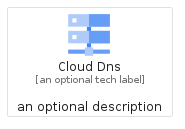
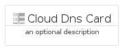
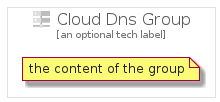

# CloudDns


```text
gcp/Item/CloudDns
```

```text
include('gcp/Item/CloudDns')
```


| Illustration | CloudDns | CloudDnsCard | CloudDnsGroup |
| :---: | :---: | :---: | :---: |
|  |  |  |  |


## CloudDns

### Load remotely
```plantuml
@startuml
' configures the library
!global $LIB_BASE_LOCATION="https://raw.githubusercontent.com/tmorin/plantuml-libs/master/distribution"

' loads the library's bootstrap
!include $LIB_BASE_LOCATION/bootstrap.puml

' loads the package bootstrap
include('gcp/bootstrap')

' loads the Item which embeds the element CloudDns
include('gcp/Item/CloudDns')

' renders the element
CloudDns('CloudDns', 'Cloud Dns', 'an optional tech label')
@enduml
```

### Load locally
```plantuml
@startuml
' configures the library
!global $INCLUSION_MODE="local"
!global $LIB_BASE_LOCATION="../.."

' loads the library's bootstrap
!include $LIB_BASE_LOCATION/bootstrap.puml

' loads the package bootstrap
include('gcp/bootstrap')

' loads the Item which embeds the element CloudDns
include('gcp/Item/CloudDns')

' renders the element
CloudDns('CloudDns', 'Cloud Dns', 'an optional tech label')
@enduml
```

## CloudDnsCard

### Load remotely
```plantuml
@startuml
' configures the library
!global $LIB_BASE_LOCATION="https://raw.githubusercontent.com/tmorin/plantuml-libs/master/distribution"

' loads the library's bootstrap
!include $LIB_BASE_LOCATION/bootstrap.puml

' loads the package bootstrap
include('gcp/bootstrap')

' loads the Item which embeds the element CloudDnsCard
include('gcp/Item/CloudDns')

' renders the element
CloudDnsCard('CloudDnsCard', 'Cloud Dns Card', 'an optional description')
@enduml
```

### Load locally
```plantuml
@startuml
' configures the library
!global $INCLUSION_MODE="local"
!global $LIB_BASE_LOCATION="../.."

' loads the library's bootstrap
!include $LIB_BASE_LOCATION/bootstrap.puml

' loads the package bootstrap
include('gcp/bootstrap')

' loads the Item which embeds the element CloudDnsCard
include('gcp/Item/CloudDns')

' renders the element
CloudDnsCard('CloudDnsCard', 'Cloud Dns Card', 'an optional description')
@enduml
```

## CloudDnsGroup

### Load remotely
```plantuml
@startuml
' configures the library
!global $LIB_BASE_LOCATION="https://raw.githubusercontent.com/tmorin/plantuml-libs/master/distribution"

' loads the library's bootstrap
!include $LIB_BASE_LOCATION/bootstrap.puml

' loads the package bootstrap
include('gcp/bootstrap')

' loads the Item which embeds the element CloudDnsGroup
include('gcp/Item/CloudDns')

' renders the element
CloudDnsGroup('CloudDnsGroup', 'Cloud Dns Group', 'an optional tech label') {
    note as note
        the content of the group
    end note
}
@enduml
```

### Load locally
```plantuml
@startuml
' configures the library
!global $INCLUSION_MODE="local"
!global $LIB_BASE_LOCATION="../.."

' loads the library's bootstrap
!include $LIB_BASE_LOCATION/bootstrap.puml

' loads the package bootstrap
include('gcp/bootstrap')

' loads the Item which embeds the element CloudDnsGroup
include('gcp/Item/CloudDns')

' renders the element
CloudDnsGroup('CloudDnsGroup', 'Cloud Dns Group', 'an optional tech label') {
    note as note
        the content of the group
    end note
}
@enduml
```

