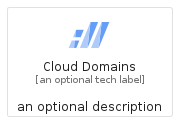
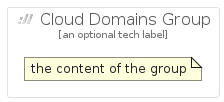

# CloudDomains


```text
gcp/Item/CloudDomains
```

```text
include('gcp/Item/CloudDomains')
```


| Illustration | CloudDomains | CloudDomainsCard | CloudDomainsGroup |
| :---: | :---: | :---: | :---: |
|  |  |  |  |


## CloudDomains

### Load remotely
```plantuml
@startuml
' configures the library
!global $LIB_BASE_LOCATION="https://raw.githubusercontent.com/tmorin/plantuml-libs/master/distribution"

' loads the library's bootstrap
!include $LIB_BASE_LOCATION/bootstrap.puml

' loads the package bootstrap
include('gcp/bootstrap')

' loads the Item which embeds the element CloudDomains
include('gcp/Item/CloudDomains')

' renders the element
CloudDomains('CloudDomains', 'Cloud Domains', 'an optional tech label', 'an optional description')
@enduml
```

### Load locally
```plantuml
@startuml
' configures the library
!global $INCLUSION_MODE="local"
!global $LIB_BASE_LOCATION="../.."

' loads the library's bootstrap
!include $LIB_BASE_LOCATION/bootstrap.puml

' loads the package bootstrap
include('gcp/bootstrap')

' loads the Item which embeds the element CloudDomains
include('gcp/Item/CloudDomains')

' renders the element
CloudDomains('CloudDomains', 'Cloud Domains', 'an optional tech label', 'an optional description')
@enduml
```

## CloudDomainsCard

### Load remotely
```plantuml
@startuml
' configures the library
!global $LIB_BASE_LOCATION="https://raw.githubusercontent.com/tmorin/plantuml-libs/master/distribution"

' loads the library's bootstrap
!include $LIB_BASE_LOCATION/bootstrap.puml

' loads the package bootstrap
include('gcp/bootstrap')

' loads the Item which embeds the element CloudDomainsCard
include('gcp/Item/CloudDomains')

' renders the element
CloudDomainsCard('CloudDomainsCard', 'Cloud Domains Card', 'an optional description')
@enduml
```

### Load locally
```plantuml
@startuml
' configures the library
!global $INCLUSION_MODE="local"
!global $LIB_BASE_LOCATION="../.."

' loads the library's bootstrap
!include $LIB_BASE_LOCATION/bootstrap.puml

' loads the package bootstrap
include('gcp/bootstrap')

' loads the Item which embeds the element CloudDomainsCard
include('gcp/Item/CloudDomains')

' renders the element
CloudDomainsCard('CloudDomainsCard', 'Cloud Domains Card', 'an optional description')
@enduml
```

## CloudDomainsGroup

### Load remotely
```plantuml
@startuml
' configures the library
!global $LIB_BASE_LOCATION="https://raw.githubusercontent.com/tmorin/plantuml-libs/master/distribution"

' loads the library's bootstrap
!include $LIB_BASE_LOCATION/bootstrap.puml

' loads the package bootstrap
include('gcp/bootstrap')

' loads the Item which embeds the element CloudDomainsGroup
include('gcp/Item/CloudDomains')

' renders the element
CloudDomainsGroup('CloudDomainsGroup', 'Cloud Domains Group', 'an optional tech label') {
    note as note
        the content of the group
    end note
}
@enduml
```

### Load locally
```plantuml
@startuml
' configures the library
!global $INCLUSION_MODE="local"
!global $LIB_BASE_LOCATION="../.."

' loads the library's bootstrap
!include $LIB_BASE_LOCATION/bootstrap.puml

' loads the package bootstrap
include('gcp/bootstrap')

' loads the Item which embeds the element CloudDomainsGroup
include('gcp/Item/CloudDomains')

' renders the element
CloudDomainsGroup('CloudDomainsGroup', 'Cloud Domains Group', 'an optional tech label') {
    note as note
        the content of the group
    end note
}
@enduml
```

