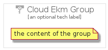

# CloudEkm


```text
gcp/Item/CloudEkm
```

```text
include('gcp/Item/CloudEkm')
```


| Illustration | CloudEkm | CloudEkmCard | CloudEkmGroup |
| :---: | :---: | :---: | :---: |
|  |  |  |  |


## CloudEkm

### Load remotely
```plantuml
@startuml
' configures the library
!global $LIB_BASE_LOCATION="https://raw.githubusercontent.com/tmorin/plantuml-libs/master/distribution"

' loads the library's bootstrap
!include $LIB_BASE_LOCATION/bootstrap.puml

' loads the package bootstrap
include('gcp/bootstrap')

' loads the Item which embeds the element CloudEkm
include('gcp/Item/CloudEkm')

' renders the element
CloudEkm('CloudEkm', 'Cloud Ekm', 'an optional tech label')
@enduml
```

### Load locally
```plantuml
@startuml
' configures the library
!global $INCLUSION_MODE="local"
!global $LIB_BASE_LOCATION="../.."

' loads the library's bootstrap
!include $LIB_BASE_LOCATION/bootstrap.puml

' loads the package bootstrap
include('gcp/bootstrap')

' loads the Item which embeds the element CloudEkm
include('gcp/Item/CloudEkm')

' renders the element
CloudEkm('CloudEkm', 'Cloud Ekm', 'an optional tech label')
@enduml
```

## CloudEkmCard

### Load remotely
```plantuml
@startuml
' configures the library
!global $LIB_BASE_LOCATION="https://raw.githubusercontent.com/tmorin/plantuml-libs/master/distribution"

' loads the library's bootstrap
!include $LIB_BASE_LOCATION/bootstrap.puml

' loads the package bootstrap
include('gcp/bootstrap')

' loads the Item which embeds the element CloudEkmCard
include('gcp/Item/CloudEkm')

' renders the element
CloudEkmCard('CloudEkmCard', 'Cloud Ekm Card', 'an optional description')
@enduml
```

### Load locally
```plantuml
@startuml
' configures the library
!global $INCLUSION_MODE="local"
!global $LIB_BASE_LOCATION="../.."

' loads the library's bootstrap
!include $LIB_BASE_LOCATION/bootstrap.puml

' loads the package bootstrap
include('gcp/bootstrap')

' loads the Item which embeds the element CloudEkmCard
include('gcp/Item/CloudEkm')

' renders the element
CloudEkmCard('CloudEkmCard', 'Cloud Ekm Card', 'an optional description')
@enduml
```

## CloudEkmGroup

### Load remotely
```plantuml
@startuml
' configures the library
!global $LIB_BASE_LOCATION="https://raw.githubusercontent.com/tmorin/plantuml-libs/master/distribution"

' loads the library's bootstrap
!include $LIB_BASE_LOCATION/bootstrap.puml

' loads the package bootstrap
include('gcp/bootstrap')

' loads the Item which embeds the element CloudEkmGroup
include('gcp/Item/CloudEkm')

' renders the element
CloudEkmGroup('CloudEkmGroup', 'Cloud Ekm Group', 'an optional tech label') {
    note as note
        the content of the group
    end note
}
@enduml
```

### Load locally
```plantuml
@startuml
' configures the library
!global $INCLUSION_MODE="local"
!global $LIB_BASE_LOCATION="../.."

' loads the library's bootstrap
!include $LIB_BASE_LOCATION/bootstrap.puml

' loads the package bootstrap
include('gcp/bootstrap')

' loads the Item which embeds the element CloudEkmGroup
include('gcp/Item/CloudEkm')

' renders the element
CloudEkmGroup('CloudEkmGroup', 'Cloud Ekm Group', 'an optional tech label') {
    note as note
        the content of the group
    end note
}
@enduml
```

