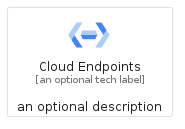
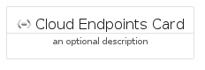
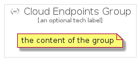

# CloudEndpoints


```text
gcp/Item/CloudEndpoints
```

```text
include('gcp/Item/CloudEndpoints')
```


| Illustration | CloudEndpoints | CloudEndpointsCard | CloudEndpointsGroup |
| :---: | :---: | :---: | :---: |
|  |  |  |  |


## Sprites
The item provides the following sriptes:

- `<$CloudEndpointsXs>`
- `<$CloudEndpointsSm>`
- `<$CloudEndpointsMd>`
- `<$CloudEndpointsLg>`


## CloudEndpoints

### Load remotely
```plantuml
@startuml
' configures the library
!global $LIB_BASE_LOCATION="https://raw.githubusercontent.com/tmorin/plantuml-libs/master/distribution"

' loads the library's bootstrap
!include $LIB_BASE_LOCATION/bootstrap.puml

' loads the package bootstrap
include('gcp/bootstrap')

' loads the Item which embeds the element CloudEndpoints
include('gcp/Item/CloudEndpoints')

' renders the element
CloudEndpoints('CloudEndpoints', 'Cloud Endpoints', 'an optional tech label', 'an optional description')
@enduml
```

### Load locally
```plantuml
@startuml
' configures the library
!global $INCLUSION_MODE="local"
!global $LIB_BASE_LOCATION="../.."

' loads the library's bootstrap
!include $LIB_BASE_LOCATION/bootstrap.puml

' loads the package bootstrap
include('gcp/bootstrap')

' loads the Item which embeds the element CloudEndpoints
include('gcp/Item/CloudEndpoints')

' renders the element
CloudEndpoints('CloudEndpoints', 'Cloud Endpoints', 'an optional tech label', 'an optional description')
@enduml
```

## CloudEndpointsCard

### Load remotely
```plantuml
@startuml
' configures the library
!global $LIB_BASE_LOCATION="https://raw.githubusercontent.com/tmorin/plantuml-libs/master/distribution"

' loads the library's bootstrap
!include $LIB_BASE_LOCATION/bootstrap.puml

' loads the package bootstrap
include('gcp/bootstrap')

' loads the Item which embeds the element CloudEndpointsCard
include('gcp/Item/CloudEndpoints')

' renders the element
CloudEndpointsCard('CloudEndpointsCard', 'Cloud Endpoints Card', 'an optional description')
@enduml
```

### Load locally
```plantuml
@startuml
' configures the library
!global $INCLUSION_MODE="local"
!global $LIB_BASE_LOCATION="../.."

' loads the library's bootstrap
!include $LIB_BASE_LOCATION/bootstrap.puml

' loads the package bootstrap
include('gcp/bootstrap')

' loads the Item which embeds the element CloudEndpointsCard
include('gcp/Item/CloudEndpoints')

' renders the element
CloudEndpointsCard('CloudEndpointsCard', 'Cloud Endpoints Card', 'an optional description')
@enduml
```

## CloudEndpointsGroup

### Load remotely
```plantuml
@startuml
' configures the library
!global $LIB_BASE_LOCATION="https://raw.githubusercontent.com/tmorin/plantuml-libs/master/distribution"

' loads the library's bootstrap
!include $LIB_BASE_LOCATION/bootstrap.puml

' loads the package bootstrap
include('gcp/bootstrap')

' loads the Item which embeds the element CloudEndpointsGroup
include('gcp/Item/CloudEndpoints')

' renders the element
CloudEndpointsGroup('CloudEndpointsGroup', 'Cloud Endpoints Group', 'an optional tech label') {
    note as note
        the content of the group
    end note
}
@enduml
```

### Load locally
```plantuml
@startuml
' configures the library
!global $INCLUSION_MODE="local"
!global $LIB_BASE_LOCATION="../.."

' loads the library's bootstrap
!include $LIB_BASE_LOCATION/bootstrap.puml

' loads the package bootstrap
include('gcp/bootstrap')

' loads the Item which embeds the element CloudEndpointsGroup
include('gcp/Item/CloudEndpoints')

' renders the element
CloudEndpointsGroup('CloudEndpointsGroup', 'Cloud Endpoints Group', 'an optional tech label') {
    note as note
        the content of the group
    end note
}
@enduml
```

