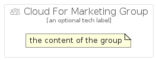

# CloudForMarketing


```text
gcp/Item/CloudForMarketing
```

```text
include('gcp/Item/CloudForMarketing')
```


| Illustration | CloudForMarketing | CloudForMarketingCard | CloudForMarketingGroup |
| :---: | :---: | :---: | :---: |
|  |  |  |  |


## CloudForMarketing

### Load remotely
```plantuml
@startuml
' configures the library
!global $LIB_BASE_LOCATION="https://raw.githubusercontent.com/tmorin/plantuml-libs/master/distribution"

' loads the library's bootstrap
!include $LIB_BASE_LOCATION/bootstrap.puml

' loads the package bootstrap
include('gcp/bootstrap')

' loads the Item which embeds the element CloudForMarketing
include('gcp/Item/CloudForMarketing')

' renders the element
CloudForMarketing('CloudForMarketing', 'Cloud For Marketing', 'an optional tech label', 'an optional description')
@enduml
```

### Load locally
```plantuml
@startuml
' configures the library
!global $INCLUSION_MODE="local"
!global $LIB_BASE_LOCATION="../.."

' loads the library's bootstrap
!include $LIB_BASE_LOCATION/bootstrap.puml

' loads the package bootstrap
include('gcp/bootstrap')

' loads the Item which embeds the element CloudForMarketing
include('gcp/Item/CloudForMarketing')

' renders the element
CloudForMarketing('CloudForMarketing', 'Cloud For Marketing', 'an optional tech label', 'an optional description')
@enduml
```

## CloudForMarketingCard

### Load remotely
```plantuml
@startuml
' configures the library
!global $LIB_BASE_LOCATION="https://raw.githubusercontent.com/tmorin/plantuml-libs/master/distribution"

' loads the library's bootstrap
!include $LIB_BASE_LOCATION/bootstrap.puml

' loads the package bootstrap
include('gcp/bootstrap')

' loads the Item which embeds the element CloudForMarketingCard
include('gcp/Item/CloudForMarketing')

' renders the element
CloudForMarketingCard('CloudForMarketingCard', 'Cloud For Marketing Card', 'an optional description')
@enduml
```

### Load locally
```plantuml
@startuml
' configures the library
!global $INCLUSION_MODE="local"
!global $LIB_BASE_LOCATION="../.."

' loads the library's bootstrap
!include $LIB_BASE_LOCATION/bootstrap.puml

' loads the package bootstrap
include('gcp/bootstrap')

' loads the Item which embeds the element CloudForMarketingCard
include('gcp/Item/CloudForMarketing')

' renders the element
CloudForMarketingCard('CloudForMarketingCard', 'Cloud For Marketing Card', 'an optional description')
@enduml
```

## CloudForMarketingGroup

### Load remotely
```plantuml
@startuml
' configures the library
!global $LIB_BASE_LOCATION="https://raw.githubusercontent.com/tmorin/plantuml-libs/master/distribution"

' loads the library's bootstrap
!include $LIB_BASE_LOCATION/bootstrap.puml

' loads the package bootstrap
include('gcp/bootstrap')

' loads the Item which embeds the element CloudForMarketingGroup
include('gcp/Item/CloudForMarketing')

' renders the element
CloudForMarketingGroup('CloudForMarketingGroup', 'Cloud For Marketing Group', 'an optional tech label') {
    note as note
        the content of the group
    end note
}
@enduml
```

### Load locally
```plantuml
@startuml
' configures the library
!global $INCLUSION_MODE="local"
!global $LIB_BASE_LOCATION="../.."

' loads the library's bootstrap
!include $LIB_BASE_LOCATION/bootstrap.puml

' loads the package bootstrap
include('gcp/bootstrap')

' loads the Item which embeds the element CloudForMarketingGroup
include('gcp/Item/CloudForMarketing')

' renders the element
CloudForMarketingGroup('CloudForMarketingGroup', 'Cloud For Marketing Group', 'an optional tech label') {
    note as note
        the content of the group
    end note
}
@enduml
```

