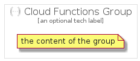

# CloudFunctions


```text
gcp/Item/CloudFunctions
```

```text
include('gcp/Item/CloudFunctions')
```


| Illustration | CloudFunctions | CloudFunctionsCard | CloudFunctionsGroup |
| :---: | :---: | :---: | :---: |
|  |  |  |  |


## Sprites
The item provides the following sriptes:

- `<$CloudFunctionsXs>`
- `<$CloudFunctionsSm>`
- `<$CloudFunctionsMd>`
- `<$CloudFunctionsLg>`


## CloudFunctions

### Load remotely
```plantuml
@startuml
' configures the library
!global $LIB_BASE_LOCATION="https://raw.githubusercontent.com/tmorin/plantuml-libs/master/distribution"

' loads the library's bootstrap
!include $LIB_BASE_LOCATION/bootstrap.puml

' loads the package bootstrap
include('gcp/bootstrap')

' loads the Item which embeds the element CloudFunctions
include('gcp/Item/CloudFunctions')

' renders the element
CloudFunctions('CloudFunctions', 'Cloud Functions', 'an optional tech label', 'an optional description')
@enduml
```

### Load locally
```plantuml
@startuml
' configures the library
!global $INCLUSION_MODE="local"
!global $LIB_BASE_LOCATION="../.."

' loads the library's bootstrap
!include $LIB_BASE_LOCATION/bootstrap.puml

' loads the package bootstrap
include('gcp/bootstrap')

' loads the Item which embeds the element CloudFunctions
include('gcp/Item/CloudFunctions')

' renders the element
CloudFunctions('CloudFunctions', 'Cloud Functions', 'an optional tech label', 'an optional description')
@enduml
```

## CloudFunctionsCard

### Load remotely
```plantuml
@startuml
' configures the library
!global $LIB_BASE_LOCATION="https://raw.githubusercontent.com/tmorin/plantuml-libs/master/distribution"

' loads the library's bootstrap
!include $LIB_BASE_LOCATION/bootstrap.puml

' loads the package bootstrap
include('gcp/bootstrap')

' loads the Item which embeds the element CloudFunctionsCard
include('gcp/Item/CloudFunctions')

' renders the element
CloudFunctionsCard('CloudFunctionsCard', 'Cloud Functions Card', 'an optional description')
@enduml
```

### Load locally
```plantuml
@startuml
' configures the library
!global $INCLUSION_MODE="local"
!global $LIB_BASE_LOCATION="../.."

' loads the library's bootstrap
!include $LIB_BASE_LOCATION/bootstrap.puml

' loads the package bootstrap
include('gcp/bootstrap')

' loads the Item which embeds the element CloudFunctionsCard
include('gcp/Item/CloudFunctions')

' renders the element
CloudFunctionsCard('CloudFunctionsCard', 'Cloud Functions Card', 'an optional description')
@enduml
```

## CloudFunctionsGroup

### Load remotely
```plantuml
@startuml
' configures the library
!global $LIB_BASE_LOCATION="https://raw.githubusercontent.com/tmorin/plantuml-libs/master/distribution"

' loads the library's bootstrap
!include $LIB_BASE_LOCATION/bootstrap.puml

' loads the package bootstrap
include('gcp/bootstrap')

' loads the Item which embeds the element CloudFunctionsGroup
include('gcp/Item/CloudFunctions')

' renders the element
CloudFunctionsGroup('CloudFunctionsGroup', 'Cloud Functions Group', 'an optional tech label') {
    note as note
        the content of the group
    end note
}
@enduml
```

### Load locally
```plantuml
@startuml
' configures the library
!global $INCLUSION_MODE="local"
!global $LIB_BASE_LOCATION="../.."

' loads the library's bootstrap
!include $LIB_BASE_LOCATION/bootstrap.puml

' loads the package bootstrap
include('gcp/bootstrap')

' loads the Item which embeds the element CloudFunctionsGroup
include('gcp/Item/CloudFunctions')

' renders the element
CloudFunctionsGroup('CloudFunctionsGroup', 'Cloud Functions Group', 'an optional tech label') {
    note as note
        the content of the group
    end note
}
@enduml
```

