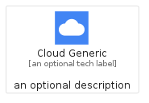
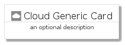
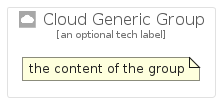

# CloudGeneric


```text
gcp/Item/CloudGeneric
```

```text
include('gcp/Item/CloudGeneric')
```


| Illustration | CloudGeneric | CloudGenericCard | CloudGenericGroup |
| :---: | :---: | :---: | :---: |
|  |  |  |  |


## CloudGeneric

### Load remotely
```plantuml
@startuml
' configures the library
!global $LIB_BASE_LOCATION="https://raw.githubusercontent.com/tmorin/plantuml-libs/master/distribution"

' loads the library's bootstrap
!include $LIB_BASE_LOCATION/bootstrap.puml

' loads the package bootstrap
include('gcp/bootstrap')

' loads the Item which embeds the element CloudGeneric
include('gcp/Item/CloudGeneric')

' renders the element
CloudGeneric('CloudGeneric', 'Cloud Generic', 'an optional tech label')
@enduml
```

### Load locally
```plantuml
@startuml
' configures the library
!global $INCLUSION_MODE="local"
!global $LIB_BASE_LOCATION="../.."

' loads the library's bootstrap
!include $LIB_BASE_LOCATION/bootstrap.puml

' loads the package bootstrap
include('gcp/bootstrap')

' loads the Item which embeds the element CloudGeneric
include('gcp/Item/CloudGeneric')

' renders the element
CloudGeneric('CloudGeneric', 'Cloud Generic', 'an optional tech label')
@enduml
```

## CloudGenericCard

### Load remotely
```plantuml
@startuml
' configures the library
!global $LIB_BASE_LOCATION="https://raw.githubusercontent.com/tmorin/plantuml-libs/master/distribution"

' loads the library's bootstrap
!include $LIB_BASE_LOCATION/bootstrap.puml

' loads the package bootstrap
include('gcp/bootstrap')

' loads the Item which embeds the element CloudGenericCard
include('gcp/Item/CloudGeneric')

' renders the element
CloudGenericCard('CloudGenericCard', 'Cloud Generic Card', 'an optional description')
@enduml
```

### Load locally
```plantuml
@startuml
' configures the library
!global $INCLUSION_MODE="local"
!global $LIB_BASE_LOCATION="../.."

' loads the library's bootstrap
!include $LIB_BASE_LOCATION/bootstrap.puml

' loads the package bootstrap
include('gcp/bootstrap')

' loads the Item which embeds the element CloudGenericCard
include('gcp/Item/CloudGeneric')

' renders the element
CloudGenericCard('CloudGenericCard', 'Cloud Generic Card', 'an optional description')
@enduml
```

## CloudGenericGroup

### Load remotely
```plantuml
@startuml
' configures the library
!global $LIB_BASE_LOCATION="https://raw.githubusercontent.com/tmorin/plantuml-libs/master/distribution"

' loads the library's bootstrap
!include $LIB_BASE_LOCATION/bootstrap.puml

' loads the package bootstrap
include('gcp/bootstrap')

' loads the Item which embeds the element CloudGenericGroup
include('gcp/Item/CloudGeneric')

' renders the element
CloudGenericGroup('CloudGenericGroup', 'Cloud Generic Group', 'an optional tech label') {
    note as note
        the content of the group
    end note
}
@enduml
```

### Load locally
```plantuml
@startuml
' configures the library
!global $INCLUSION_MODE="local"
!global $LIB_BASE_LOCATION="../.."

' loads the library's bootstrap
!include $LIB_BASE_LOCATION/bootstrap.puml

' loads the package bootstrap
include('gcp/bootstrap')

' loads the Item which embeds the element CloudGenericGroup
include('gcp/Item/CloudGeneric')

' renders the element
CloudGenericGroup('CloudGenericGroup', 'Cloud Generic Group', 'an optional tech label') {
    note as note
        the content of the group
    end note
}
@enduml
```

