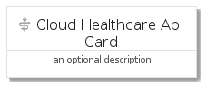
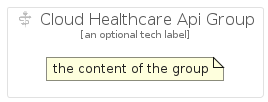

# CloudHealthcareApi


```text
gcp/Item/CloudHealthcareApi
```

```text
include('gcp/Item/CloudHealthcareApi')
```


| Illustration | CloudHealthcareApi | CloudHealthcareApiCard | CloudHealthcareApiGroup |
| :---: | :---: | :---: | :---: |
|  |  |  |  |


## CloudHealthcareApi

### Load remotely
```plantuml
@startuml
' configures the library
!global $LIB_BASE_LOCATION="https://raw.githubusercontent.com/tmorin/plantuml-libs/master/distribution"

' loads the library's bootstrap
!include $LIB_BASE_LOCATION/bootstrap.puml

' loads the package bootstrap
include('gcp/bootstrap')

' loads the Item which embeds the element CloudHealthcareApi
include('gcp/Item/CloudHealthcareApi')

' renders the element
CloudHealthcareApi('CloudHealthcareApi', 'Cloud Healthcare Api', 'an optional tech label')
@enduml
```

### Load locally
```plantuml
@startuml
' configures the library
!global $INCLUSION_MODE="local"
!global $LIB_BASE_LOCATION="../.."

' loads the library's bootstrap
!include $LIB_BASE_LOCATION/bootstrap.puml

' loads the package bootstrap
include('gcp/bootstrap')

' loads the Item which embeds the element CloudHealthcareApi
include('gcp/Item/CloudHealthcareApi')

' renders the element
CloudHealthcareApi('CloudHealthcareApi', 'Cloud Healthcare Api', 'an optional tech label')
@enduml
```

## CloudHealthcareApiCard

### Load remotely
```plantuml
@startuml
' configures the library
!global $LIB_BASE_LOCATION="https://raw.githubusercontent.com/tmorin/plantuml-libs/master/distribution"

' loads the library's bootstrap
!include $LIB_BASE_LOCATION/bootstrap.puml

' loads the package bootstrap
include('gcp/bootstrap')

' loads the Item which embeds the element CloudHealthcareApiCard
include('gcp/Item/CloudHealthcareApi')

' renders the element
CloudHealthcareApiCard('CloudHealthcareApiCard', 'Cloud Healthcare Api Card', 'an optional description')
@enduml
```

### Load locally
```plantuml
@startuml
' configures the library
!global $INCLUSION_MODE="local"
!global $LIB_BASE_LOCATION="../.."

' loads the library's bootstrap
!include $LIB_BASE_LOCATION/bootstrap.puml

' loads the package bootstrap
include('gcp/bootstrap')

' loads the Item which embeds the element CloudHealthcareApiCard
include('gcp/Item/CloudHealthcareApi')

' renders the element
CloudHealthcareApiCard('CloudHealthcareApiCard', 'Cloud Healthcare Api Card', 'an optional description')
@enduml
```

## CloudHealthcareApiGroup

### Load remotely
```plantuml
@startuml
' configures the library
!global $LIB_BASE_LOCATION="https://raw.githubusercontent.com/tmorin/plantuml-libs/master/distribution"

' loads the library's bootstrap
!include $LIB_BASE_LOCATION/bootstrap.puml

' loads the package bootstrap
include('gcp/bootstrap')

' loads the Item which embeds the element CloudHealthcareApiGroup
include('gcp/Item/CloudHealthcareApi')

' renders the element
CloudHealthcareApiGroup('CloudHealthcareApiGroup', 'Cloud Healthcare Api Group', 'an optional tech label') {
    note as note
        the content of the group
    end note
}
@enduml
```

### Load locally
```plantuml
@startuml
' configures the library
!global $INCLUSION_MODE="local"
!global $LIB_BASE_LOCATION="../.."

' loads the library's bootstrap
!include $LIB_BASE_LOCATION/bootstrap.puml

' loads the package bootstrap
include('gcp/bootstrap')

' loads the Item which embeds the element CloudHealthcareApiGroup
include('gcp/Item/CloudHealthcareApi')

' renders the element
CloudHealthcareApiGroup('CloudHealthcareApiGroup', 'Cloud Healthcare Api Group', 'an optional tech label') {
    note as note
        the content of the group
    end note
}
@enduml
```

