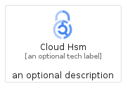
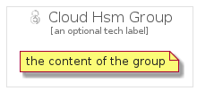

# CloudHsm


```text
gcp/Item/CloudHsm
```

```text
include('gcp/Item/CloudHsm')
```


| Illustration | CloudHsm | CloudHsmCard | CloudHsmGroup |
| :---: | :---: | :---: | :---: |
|  |  |  |  |


## Sprites
The item provides the following sriptes:

- `<$CloudHsmXs>`
- `<$CloudHsmSm>`
- `<$CloudHsmMd>`
- `<$CloudHsmLg>`


## CloudHsm

### Load remotely
```plantuml
@startuml
' configures the library
!global $LIB_BASE_LOCATION="https://raw.githubusercontent.com/tmorin/plantuml-libs/master/distribution"

' loads the library's bootstrap
!include $LIB_BASE_LOCATION/bootstrap.puml

' loads the package bootstrap
include('gcp/bootstrap')

' loads the Item which embeds the element CloudHsm
include('gcp/Item/CloudHsm')

' renders the element
CloudHsm('CloudHsm', 'Cloud Hsm', 'an optional tech label', 'an optional description')
@enduml
```

### Load locally
```plantuml
@startuml
' configures the library
!global $INCLUSION_MODE="local"
!global $LIB_BASE_LOCATION="../.."

' loads the library's bootstrap
!include $LIB_BASE_LOCATION/bootstrap.puml

' loads the package bootstrap
include('gcp/bootstrap')

' loads the Item which embeds the element CloudHsm
include('gcp/Item/CloudHsm')

' renders the element
CloudHsm('CloudHsm', 'Cloud Hsm', 'an optional tech label', 'an optional description')
@enduml
```

## CloudHsmCard

### Load remotely
```plantuml
@startuml
' configures the library
!global $LIB_BASE_LOCATION="https://raw.githubusercontent.com/tmorin/plantuml-libs/master/distribution"

' loads the library's bootstrap
!include $LIB_BASE_LOCATION/bootstrap.puml

' loads the package bootstrap
include('gcp/bootstrap')

' loads the Item which embeds the element CloudHsmCard
include('gcp/Item/CloudHsm')

' renders the element
CloudHsmCard('CloudHsmCard', 'Cloud Hsm Card', 'an optional description')
@enduml
```

### Load locally
```plantuml
@startuml
' configures the library
!global $INCLUSION_MODE="local"
!global $LIB_BASE_LOCATION="../.."

' loads the library's bootstrap
!include $LIB_BASE_LOCATION/bootstrap.puml

' loads the package bootstrap
include('gcp/bootstrap')

' loads the Item which embeds the element CloudHsmCard
include('gcp/Item/CloudHsm')

' renders the element
CloudHsmCard('CloudHsmCard', 'Cloud Hsm Card', 'an optional description')
@enduml
```

## CloudHsmGroup

### Load remotely
```plantuml
@startuml
' configures the library
!global $LIB_BASE_LOCATION="https://raw.githubusercontent.com/tmorin/plantuml-libs/master/distribution"

' loads the library's bootstrap
!include $LIB_BASE_LOCATION/bootstrap.puml

' loads the package bootstrap
include('gcp/bootstrap')

' loads the Item which embeds the element CloudHsmGroup
include('gcp/Item/CloudHsm')

' renders the element
CloudHsmGroup('CloudHsmGroup', 'Cloud Hsm Group', 'an optional tech label') {
    note as note
        the content of the group
    end note
}
@enduml
```

### Load locally
```plantuml
@startuml
' configures the library
!global $INCLUSION_MODE="local"
!global $LIB_BASE_LOCATION="../.."

' loads the library's bootstrap
!include $LIB_BASE_LOCATION/bootstrap.puml

' loads the package bootstrap
include('gcp/bootstrap')

' loads the Item which embeds the element CloudHsmGroup
include('gcp/Item/CloudHsm')

' renders the element
CloudHsmGroup('CloudHsmGroup', 'Cloud Hsm Group', 'an optional tech label') {
    note as note
        the content of the group
    end note
}
@enduml
```

