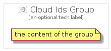

# CloudIds


```text
gcp/Item/CloudIds
```

```text
include('gcp/Item/CloudIds')
```


| Illustration | CloudIds | CloudIdsCard | CloudIdsGroup |
| :---: | :---: | :---: | :---: |
|  |  |  |  |


## CloudIds

### Load remotely
```plantuml
@startuml
' configures the library
!global $LIB_BASE_LOCATION="https://raw.githubusercontent.com/tmorin/plantuml-libs/master/distribution"

' loads the library's bootstrap
!include $LIB_BASE_LOCATION/bootstrap.puml

' loads the package bootstrap
include('gcp/bootstrap')

' loads the Item which embeds the element CloudIds
include('gcp/Item/CloudIds')

' renders the element
CloudIds('CloudIds', 'Cloud Ids', 'an optional tech label')
@enduml
```

### Load locally
```plantuml
@startuml
' configures the library
!global $INCLUSION_MODE="local"
!global $LIB_BASE_LOCATION="../.."

' loads the library's bootstrap
!include $LIB_BASE_LOCATION/bootstrap.puml

' loads the package bootstrap
include('gcp/bootstrap')

' loads the Item which embeds the element CloudIds
include('gcp/Item/CloudIds')

' renders the element
CloudIds('CloudIds', 'Cloud Ids', 'an optional tech label')
@enduml
```

## CloudIdsCard

### Load remotely
```plantuml
@startuml
' configures the library
!global $LIB_BASE_LOCATION="https://raw.githubusercontent.com/tmorin/plantuml-libs/master/distribution"

' loads the library's bootstrap
!include $LIB_BASE_LOCATION/bootstrap.puml

' loads the package bootstrap
include('gcp/bootstrap')

' loads the Item which embeds the element CloudIdsCard
include('gcp/Item/CloudIds')

' renders the element
CloudIdsCard('CloudIdsCard', 'Cloud Ids Card', 'an optional description')
@enduml
```

### Load locally
```plantuml
@startuml
' configures the library
!global $INCLUSION_MODE="local"
!global $LIB_BASE_LOCATION="../.."

' loads the library's bootstrap
!include $LIB_BASE_LOCATION/bootstrap.puml

' loads the package bootstrap
include('gcp/bootstrap')

' loads the Item which embeds the element CloudIdsCard
include('gcp/Item/CloudIds')

' renders the element
CloudIdsCard('CloudIdsCard', 'Cloud Ids Card', 'an optional description')
@enduml
```

## CloudIdsGroup

### Load remotely
```plantuml
@startuml
' configures the library
!global $LIB_BASE_LOCATION="https://raw.githubusercontent.com/tmorin/plantuml-libs/master/distribution"

' loads the library's bootstrap
!include $LIB_BASE_LOCATION/bootstrap.puml

' loads the package bootstrap
include('gcp/bootstrap')

' loads the Item which embeds the element CloudIdsGroup
include('gcp/Item/CloudIds')

' renders the element
CloudIdsGroup('CloudIdsGroup', 'Cloud Ids Group', 'an optional tech label') {
    note as note
        the content of the group
    end note
}
@enduml
```

### Load locally
```plantuml
@startuml
' configures the library
!global $INCLUSION_MODE="local"
!global $LIB_BASE_LOCATION="../.."

' loads the library's bootstrap
!include $LIB_BASE_LOCATION/bootstrap.puml

' loads the package bootstrap
include('gcp/bootstrap')

' loads the Item which embeds the element CloudIdsGroup
include('gcp/Item/CloudIds')

' renders the element
CloudIdsGroup('CloudIdsGroup', 'Cloud Ids Group', 'an optional tech label') {
    note as note
        the content of the group
    end note
}
@enduml
```

