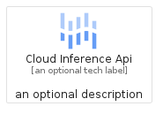
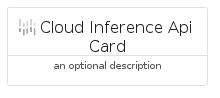
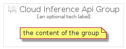

# CloudInferenceApi


```text
gcp/Item/CloudInferenceApi
```

```text
include('gcp/Item/CloudInferenceApi')
```


| Illustration | CloudInferenceApi | CloudInferenceApiCard | CloudInferenceApiGroup |
| :---: | :---: | :---: | :---: |
|  |  |  |  |


## CloudInferenceApi

### Load remotely
```plantuml
@startuml
' configures the library
!global $LIB_BASE_LOCATION="https://raw.githubusercontent.com/tmorin/plantuml-libs/master/distribution"

' loads the library's bootstrap
!include $LIB_BASE_LOCATION/bootstrap.puml

' loads the package bootstrap
include('gcp/bootstrap')

' loads the Item which embeds the element CloudInferenceApi
include('gcp/Item/CloudInferenceApi')

' renders the element
CloudInferenceApi('CloudInferenceApi', 'Cloud Inference Api', 'an optional tech label')
@enduml
```

### Load locally
```plantuml
@startuml
' configures the library
!global $INCLUSION_MODE="local"
!global $LIB_BASE_LOCATION="../.."

' loads the library's bootstrap
!include $LIB_BASE_LOCATION/bootstrap.puml

' loads the package bootstrap
include('gcp/bootstrap')

' loads the Item which embeds the element CloudInferenceApi
include('gcp/Item/CloudInferenceApi')

' renders the element
CloudInferenceApi('CloudInferenceApi', 'Cloud Inference Api', 'an optional tech label')
@enduml
```

## CloudInferenceApiCard

### Load remotely
```plantuml
@startuml
' configures the library
!global $LIB_BASE_LOCATION="https://raw.githubusercontent.com/tmorin/plantuml-libs/master/distribution"

' loads the library's bootstrap
!include $LIB_BASE_LOCATION/bootstrap.puml

' loads the package bootstrap
include('gcp/bootstrap')

' loads the Item which embeds the element CloudInferenceApiCard
include('gcp/Item/CloudInferenceApi')

' renders the element
CloudInferenceApiCard('CloudInferenceApiCard', 'Cloud Inference Api Card', 'an optional description')
@enduml
```

### Load locally
```plantuml
@startuml
' configures the library
!global $INCLUSION_MODE="local"
!global $LIB_BASE_LOCATION="../.."

' loads the library's bootstrap
!include $LIB_BASE_LOCATION/bootstrap.puml

' loads the package bootstrap
include('gcp/bootstrap')

' loads the Item which embeds the element CloudInferenceApiCard
include('gcp/Item/CloudInferenceApi')

' renders the element
CloudInferenceApiCard('CloudInferenceApiCard', 'Cloud Inference Api Card', 'an optional description')
@enduml
```

## CloudInferenceApiGroup

### Load remotely
```plantuml
@startuml
' configures the library
!global $LIB_BASE_LOCATION="https://raw.githubusercontent.com/tmorin/plantuml-libs/master/distribution"

' loads the library's bootstrap
!include $LIB_BASE_LOCATION/bootstrap.puml

' loads the package bootstrap
include('gcp/bootstrap')

' loads the Item which embeds the element CloudInferenceApiGroup
include('gcp/Item/CloudInferenceApi')

' renders the element
CloudInferenceApiGroup('CloudInferenceApiGroup', 'Cloud Inference Api Group', 'an optional tech label') {
    note as note
        the content of the group
    end note
}
@enduml
```

### Load locally
```plantuml
@startuml
' configures the library
!global $INCLUSION_MODE="local"
!global $LIB_BASE_LOCATION="../.."

' loads the library's bootstrap
!include $LIB_BASE_LOCATION/bootstrap.puml

' loads the package bootstrap
include('gcp/bootstrap')

' loads the Item which embeds the element CloudInferenceApiGroup
include('gcp/Item/CloudInferenceApi')

' renders the element
CloudInferenceApiGroup('CloudInferenceApiGroup', 'Cloud Inference Api Group', 'an optional tech label') {
    note as note
        the content of the group
    end note
}
@enduml
```

