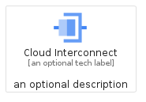
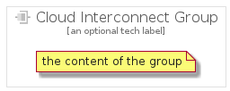

# CloudInterconnect


```text
gcp/Item/CloudInterconnect
```

```text
include('gcp/Item/CloudInterconnect')
```


| Illustration | CloudInterconnect | CloudInterconnectCard | CloudInterconnectGroup |
| :---: | :---: | :---: | :---: |
|  |  |  |  |


## CloudInterconnect

### Load remotely
```plantuml
@startuml
' configures the library
!global $LIB_BASE_LOCATION="https://raw.githubusercontent.com/tmorin/plantuml-libs/master/distribution"

' loads the library's bootstrap
!include $LIB_BASE_LOCATION/bootstrap.puml

' loads the package bootstrap
include('gcp/bootstrap')

' loads the Item which embeds the element CloudInterconnect
include('gcp/Item/CloudInterconnect')

' renders the element
CloudInterconnect('CloudInterconnect', 'Cloud Interconnect', 'an optional tech label', 'an optional description')
@enduml
```

### Load locally
```plantuml
@startuml
' configures the library
!global $INCLUSION_MODE="local"
!global $LIB_BASE_LOCATION="../.."

' loads the library's bootstrap
!include $LIB_BASE_LOCATION/bootstrap.puml

' loads the package bootstrap
include('gcp/bootstrap')

' loads the Item which embeds the element CloudInterconnect
include('gcp/Item/CloudInterconnect')

' renders the element
CloudInterconnect('CloudInterconnect', 'Cloud Interconnect', 'an optional tech label', 'an optional description')
@enduml
```

## CloudInterconnectCard

### Load remotely
```plantuml
@startuml
' configures the library
!global $LIB_BASE_LOCATION="https://raw.githubusercontent.com/tmorin/plantuml-libs/master/distribution"

' loads the library's bootstrap
!include $LIB_BASE_LOCATION/bootstrap.puml

' loads the package bootstrap
include('gcp/bootstrap')

' loads the Item which embeds the element CloudInterconnectCard
include('gcp/Item/CloudInterconnect')

' renders the element
CloudInterconnectCard('CloudInterconnectCard', 'Cloud Interconnect Card', 'an optional description')
@enduml
```

### Load locally
```plantuml
@startuml
' configures the library
!global $INCLUSION_MODE="local"
!global $LIB_BASE_LOCATION="../.."

' loads the library's bootstrap
!include $LIB_BASE_LOCATION/bootstrap.puml

' loads the package bootstrap
include('gcp/bootstrap')

' loads the Item which embeds the element CloudInterconnectCard
include('gcp/Item/CloudInterconnect')

' renders the element
CloudInterconnectCard('CloudInterconnectCard', 'Cloud Interconnect Card', 'an optional description')
@enduml
```

## CloudInterconnectGroup

### Load remotely
```plantuml
@startuml
' configures the library
!global $LIB_BASE_LOCATION="https://raw.githubusercontent.com/tmorin/plantuml-libs/master/distribution"

' loads the library's bootstrap
!include $LIB_BASE_LOCATION/bootstrap.puml

' loads the package bootstrap
include('gcp/bootstrap')

' loads the Item which embeds the element CloudInterconnectGroup
include('gcp/Item/CloudInterconnect')

' renders the element
CloudInterconnectGroup('CloudInterconnectGroup', 'Cloud Interconnect Group', 'an optional tech label') {
    note as note
        the content of the group
    end note
}
@enduml
```

### Load locally
```plantuml
@startuml
' configures the library
!global $INCLUSION_MODE="local"
!global $LIB_BASE_LOCATION="../.."

' loads the library's bootstrap
!include $LIB_BASE_LOCATION/bootstrap.puml

' loads the package bootstrap
include('gcp/bootstrap')

' loads the Item which embeds the element CloudInterconnectGroup
include('gcp/Item/CloudInterconnect')

' renders the element
CloudInterconnectGroup('CloudInterconnectGroup', 'Cloud Interconnect Group', 'an optional tech label') {
    note as note
        the content of the group
    end note
}
@enduml
```

