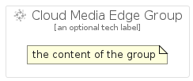

# CloudMediaEdge


```text
gcp/Item/CloudMediaEdge
```

```text
include('gcp/Item/CloudMediaEdge')
```


| Illustration | CloudMediaEdge | CloudMediaEdgeCard | CloudMediaEdgeGroup |
| :---: | :---: | :---: | :---: |
|  |  |  |  |


## CloudMediaEdge

### Load remotely
```plantuml
@startuml
' configures the library
!global $LIB_BASE_LOCATION="https://raw.githubusercontent.com/tmorin/plantuml-libs/master/distribution"

' loads the library's bootstrap
!include $LIB_BASE_LOCATION/bootstrap.puml

' loads the package bootstrap
include('gcp/bootstrap')

' loads the Item which embeds the element CloudMediaEdge
include('gcp/Item/CloudMediaEdge')

' renders the element
CloudMediaEdge('CloudMediaEdge', 'Cloud Media Edge', 'an optional tech label')
@enduml
```

### Load locally
```plantuml
@startuml
' configures the library
!global $INCLUSION_MODE="local"
!global $LIB_BASE_LOCATION="../.."

' loads the library's bootstrap
!include $LIB_BASE_LOCATION/bootstrap.puml

' loads the package bootstrap
include('gcp/bootstrap')

' loads the Item which embeds the element CloudMediaEdge
include('gcp/Item/CloudMediaEdge')

' renders the element
CloudMediaEdge('CloudMediaEdge', 'Cloud Media Edge', 'an optional tech label')
@enduml
```

## CloudMediaEdgeCard

### Load remotely
```plantuml
@startuml
' configures the library
!global $LIB_BASE_LOCATION="https://raw.githubusercontent.com/tmorin/plantuml-libs/master/distribution"

' loads the library's bootstrap
!include $LIB_BASE_LOCATION/bootstrap.puml

' loads the package bootstrap
include('gcp/bootstrap')

' loads the Item which embeds the element CloudMediaEdgeCard
include('gcp/Item/CloudMediaEdge')

' renders the element
CloudMediaEdgeCard('CloudMediaEdgeCard', 'Cloud Media Edge Card', 'an optional description')
@enduml
```

### Load locally
```plantuml
@startuml
' configures the library
!global $INCLUSION_MODE="local"
!global $LIB_BASE_LOCATION="../.."

' loads the library's bootstrap
!include $LIB_BASE_LOCATION/bootstrap.puml

' loads the package bootstrap
include('gcp/bootstrap')

' loads the Item which embeds the element CloudMediaEdgeCard
include('gcp/Item/CloudMediaEdge')

' renders the element
CloudMediaEdgeCard('CloudMediaEdgeCard', 'Cloud Media Edge Card', 'an optional description')
@enduml
```

## CloudMediaEdgeGroup

### Load remotely
```plantuml
@startuml
' configures the library
!global $LIB_BASE_LOCATION="https://raw.githubusercontent.com/tmorin/plantuml-libs/master/distribution"

' loads the library's bootstrap
!include $LIB_BASE_LOCATION/bootstrap.puml

' loads the package bootstrap
include('gcp/bootstrap')

' loads the Item which embeds the element CloudMediaEdgeGroup
include('gcp/Item/CloudMediaEdge')

' renders the element
CloudMediaEdgeGroup('CloudMediaEdgeGroup', 'Cloud Media Edge Group', 'an optional tech label') {
    note as note
        the content of the group
    end note
}
@enduml
```

### Load locally
```plantuml
@startuml
' configures the library
!global $INCLUSION_MODE="local"
!global $LIB_BASE_LOCATION="../.."

' loads the library's bootstrap
!include $LIB_BASE_LOCATION/bootstrap.puml

' loads the package bootstrap
include('gcp/bootstrap')

' loads the Item which embeds the element CloudMediaEdgeGroup
include('gcp/Item/CloudMediaEdge')

' renders the element
CloudMediaEdgeGroup('CloudMediaEdgeGroup', 'Cloud Media Edge Group', 'an optional tech label') {
    note as note
        the content of the group
    end note
}
@enduml
```

