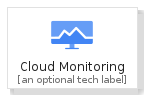
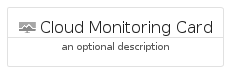
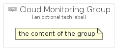

# CloudMonitoring


```text
gcp/Item/CloudMonitoring
```

```text
include('gcp/Item/CloudMonitoring')
```


| Illustration | CloudMonitoring | CloudMonitoringCard | CloudMonitoringGroup |
| :---: | :---: | :---: | :---: |
|  |  |  |  |


## CloudMonitoring

### Load remotely
```plantuml
@startuml
' configures the library
!global $LIB_BASE_LOCATION="https://raw.githubusercontent.com/tmorin/plantuml-libs/master/distribution"

' loads the library's bootstrap
!include $LIB_BASE_LOCATION/bootstrap.puml

' loads the package bootstrap
include('gcp/bootstrap')

' loads the Item which embeds the element CloudMonitoring
include('gcp/Item/CloudMonitoring')

' renders the element
CloudMonitoring('CloudMonitoring', 'Cloud Monitoring', 'an optional tech label', 'an optional description')
@enduml
```

### Load locally
```plantuml
@startuml
' configures the library
!global $INCLUSION_MODE="local"
!global $LIB_BASE_LOCATION="../.."

' loads the library's bootstrap
!include $LIB_BASE_LOCATION/bootstrap.puml

' loads the package bootstrap
include('gcp/bootstrap')

' loads the Item which embeds the element CloudMonitoring
include('gcp/Item/CloudMonitoring')

' renders the element
CloudMonitoring('CloudMonitoring', 'Cloud Monitoring', 'an optional tech label', 'an optional description')
@enduml
```

## CloudMonitoringCard

### Load remotely
```plantuml
@startuml
' configures the library
!global $LIB_BASE_LOCATION="https://raw.githubusercontent.com/tmorin/plantuml-libs/master/distribution"

' loads the library's bootstrap
!include $LIB_BASE_LOCATION/bootstrap.puml

' loads the package bootstrap
include('gcp/bootstrap')

' loads the Item which embeds the element CloudMonitoringCard
include('gcp/Item/CloudMonitoring')

' renders the element
CloudMonitoringCard('CloudMonitoringCard', 'Cloud Monitoring Card', 'an optional description')
@enduml
```

### Load locally
```plantuml
@startuml
' configures the library
!global $INCLUSION_MODE="local"
!global $LIB_BASE_LOCATION="../.."

' loads the library's bootstrap
!include $LIB_BASE_LOCATION/bootstrap.puml

' loads the package bootstrap
include('gcp/bootstrap')

' loads the Item which embeds the element CloudMonitoringCard
include('gcp/Item/CloudMonitoring')

' renders the element
CloudMonitoringCard('CloudMonitoringCard', 'Cloud Monitoring Card', 'an optional description')
@enduml
```

## CloudMonitoringGroup

### Load remotely
```plantuml
@startuml
' configures the library
!global $LIB_BASE_LOCATION="https://raw.githubusercontent.com/tmorin/plantuml-libs/master/distribution"

' loads the library's bootstrap
!include $LIB_BASE_LOCATION/bootstrap.puml

' loads the package bootstrap
include('gcp/bootstrap')

' loads the Item which embeds the element CloudMonitoringGroup
include('gcp/Item/CloudMonitoring')

' renders the element
CloudMonitoringGroup('CloudMonitoringGroup', 'Cloud Monitoring Group', 'an optional tech label') {
    note as note
        the content of the group
    end note
}
@enduml
```

### Load locally
```plantuml
@startuml
' configures the library
!global $INCLUSION_MODE="local"
!global $LIB_BASE_LOCATION="../.."

' loads the library's bootstrap
!include $LIB_BASE_LOCATION/bootstrap.puml

' loads the package bootstrap
include('gcp/bootstrap')

' loads the Item which embeds the element CloudMonitoringGroup
include('gcp/Item/CloudMonitoring')

' renders the element
CloudMonitoringGroup('CloudMonitoringGroup', 'Cloud Monitoring Group', 'an optional tech label') {
    note as note
        the content of the group
    end note
}
@enduml
```

