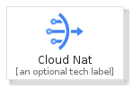
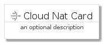
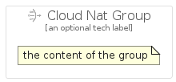

# CloudNat


```text
gcp/Item/CloudNat
```

```text
include('gcp/Item/CloudNat')
```


| Illustration | CloudNat | CloudNatCard | CloudNatGroup |
| :---: | :---: | :---: | :---: |
|  |  |  |  |


## CloudNat

### Load remotely
```plantuml
@startuml
' configures the library
!global $LIB_BASE_LOCATION="https://raw.githubusercontent.com/tmorin/plantuml-libs/master/distribution"

' loads the library's bootstrap
!include $LIB_BASE_LOCATION/bootstrap.puml

' loads the package bootstrap
include('gcp/bootstrap')

' loads the Item which embeds the element CloudNat
include('gcp/Item/CloudNat')

' renders the element
CloudNat('CloudNat', 'Cloud Nat', 'an optional tech label', 'an optional description')
@enduml
```

### Load locally
```plantuml
@startuml
' configures the library
!global $INCLUSION_MODE="local"
!global $LIB_BASE_LOCATION="../.."

' loads the library's bootstrap
!include $LIB_BASE_LOCATION/bootstrap.puml

' loads the package bootstrap
include('gcp/bootstrap')

' loads the Item which embeds the element CloudNat
include('gcp/Item/CloudNat')

' renders the element
CloudNat('CloudNat', 'Cloud Nat', 'an optional tech label', 'an optional description')
@enduml
```

## CloudNatCard

### Load remotely
```plantuml
@startuml
' configures the library
!global $LIB_BASE_LOCATION="https://raw.githubusercontent.com/tmorin/plantuml-libs/master/distribution"

' loads the library's bootstrap
!include $LIB_BASE_LOCATION/bootstrap.puml

' loads the package bootstrap
include('gcp/bootstrap')

' loads the Item which embeds the element CloudNatCard
include('gcp/Item/CloudNat')

' renders the element
CloudNatCard('CloudNatCard', 'Cloud Nat Card', 'an optional description')
@enduml
```

### Load locally
```plantuml
@startuml
' configures the library
!global $INCLUSION_MODE="local"
!global $LIB_BASE_LOCATION="../.."

' loads the library's bootstrap
!include $LIB_BASE_LOCATION/bootstrap.puml

' loads the package bootstrap
include('gcp/bootstrap')

' loads the Item which embeds the element CloudNatCard
include('gcp/Item/CloudNat')

' renders the element
CloudNatCard('CloudNatCard', 'Cloud Nat Card', 'an optional description')
@enduml
```

## CloudNatGroup

### Load remotely
```plantuml
@startuml
' configures the library
!global $LIB_BASE_LOCATION="https://raw.githubusercontent.com/tmorin/plantuml-libs/master/distribution"

' loads the library's bootstrap
!include $LIB_BASE_LOCATION/bootstrap.puml

' loads the package bootstrap
include('gcp/bootstrap')

' loads the Item which embeds the element CloudNatGroup
include('gcp/Item/CloudNat')

' renders the element
CloudNatGroup('CloudNatGroup', 'Cloud Nat Group', 'an optional tech label') {
    note as note
        the content of the group
    end note
}
@enduml
```

### Load locally
```plantuml
@startuml
' configures the library
!global $INCLUSION_MODE="local"
!global $LIB_BASE_LOCATION="../.."

' loads the library's bootstrap
!include $LIB_BASE_LOCATION/bootstrap.puml

' loads the package bootstrap
include('gcp/bootstrap')

' loads the Item which embeds the element CloudNatGroup
include('gcp/Item/CloudNat')

' renders the element
CloudNatGroup('CloudNatGroup', 'Cloud Nat Group', 'an optional tech label') {
    note as note
        the content of the group
    end note
}
@enduml
```

