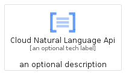
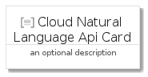
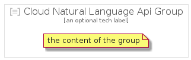

# CloudNaturalLanguageApi


```text
gcp/Item/CloudNaturalLanguageApi
```

```text
include('gcp/Item/CloudNaturalLanguageApi')
```


| Illustration | CloudNaturalLanguageApi | CloudNaturalLanguageApiCard | CloudNaturalLanguageApiGroup |
| :---: | :---: | :---: | :---: |
|  |  |  |  |


## CloudNaturalLanguageApi

### Load remotely
```plantuml
@startuml
' configures the library
!global $LIB_BASE_LOCATION="https://raw.githubusercontent.com/tmorin/plantuml-libs/master/distribution"

' loads the library's bootstrap
!include $LIB_BASE_LOCATION/bootstrap.puml

' loads the package bootstrap
include('gcp/bootstrap')

' loads the Item which embeds the element CloudNaturalLanguageApi
include('gcp/Item/CloudNaturalLanguageApi')

' renders the element
CloudNaturalLanguageApi('CloudNaturalLanguageApi', 'Cloud Natural Language Api', 'an optional tech label', 'an optional description')
@enduml
```

### Load locally
```plantuml
@startuml
' configures the library
!global $INCLUSION_MODE="local"
!global $LIB_BASE_LOCATION="../.."

' loads the library's bootstrap
!include $LIB_BASE_LOCATION/bootstrap.puml

' loads the package bootstrap
include('gcp/bootstrap')

' loads the Item which embeds the element CloudNaturalLanguageApi
include('gcp/Item/CloudNaturalLanguageApi')

' renders the element
CloudNaturalLanguageApi('CloudNaturalLanguageApi', 'Cloud Natural Language Api', 'an optional tech label', 'an optional description')
@enduml
```

## CloudNaturalLanguageApiCard

### Load remotely
```plantuml
@startuml
' configures the library
!global $LIB_BASE_LOCATION="https://raw.githubusercontent.com/tmorin/plantuml-libs/master/distribution"

' loads the library's bootstrap
!include $LIB_BASE_LOCATION/bootstrap.puml

' loads the package bootstrap
include('gcp/bootstrap')

' loads the Item which embeds the element CloudNaturalLanguageApiCard
include('gcp/Item/CloudNaturalLanguageApi')

' renders the element
CloudNaturalLanguageApiCard('CloudNaturalLanguageApiCard', 'Cloud Natural Language Api Card', 'an optional description')
@enduml
```

### Load locally
```plantuml
@startuml
' configures the library
!global $INCLUSION_MODE="local"
!global $LIB_BASE_LOCATION="../.."

' loads the library's bootstrap
!include $LIB_BASE_LOCATION/bootstrap.puml

' loads the package bootstrap
include('gcp/bootstrap')

' loads the Item which embeds the element CloudNaturalLanguageApiCard
include('gcp/Item/CloudNaturalLanguageApi')

' renders the element
CloudNaturalLanguageApiCard('CloudNaturalLanguageApiCard', 'Cloud Natural Language Api Card', 'an optional description')
@enduml
```

## CloudNaturalLanguageApiGroup

### Load remotely
```plantuml
@startuml
' configures the library
!global $LIB_BASE_LOCATION="https://raw.githubusercontent.com/tmorin/plantuml-libs/master/distribution"

' loads the library's bootstrap
!include $LIB_BASE_LOCATION/bootstrap.puml

' loads the package bootstrap
include('gcp/bootstrap')

' loads the Item which embeds the element CloudNaturalLanguageApiGroup
include('gcp/Item/CloudNaturalLanguageApi')

' renders the element
CloudNaturalLanguageApiGroup('CloudNaturalLanguageApiGroup', 'Cloud Natural Language Api Group', 'an optional tech label') {
    note as note
        the content of the group
    end note
}
@enduml
```

### Load locally
```plantuml
@startuml
' configures the library
!global $INCLUSION_MODE="local"
!global $LIB_BASE_LOCATION="../.."

' loads the library's bootstrap
!include $LIB_BASE_LOCATION/bootstrap.puml

' loads the package bootstrap
include('gcp/bootstrap')

' loads the Item which embeds the element CloudNaturalLanguageApiGroup
include('gcp/Item/CloudNaturalLanguageApi')

' renders the element
CloudNaturalLanguageApiGroup('CloudNaturalLanguageApiGroup', 'Cloud Natural Language Api Group', 'an optional tech label') {
    note as note
        the content of the group
    end note
}
@enduml
```

