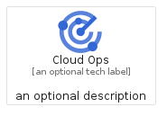
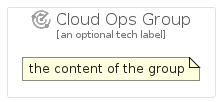

# CloudOps


```text
gcp/Item/CloudOps
```

```text
include('gcp/Item/CloudOps')
```


| Illustration | CloudOps | CloudOpsCard | CloudOpsGroup |
| :---: | :---: | :---: | :---: |
|  |  |  |  |


## CloudOps

### Load remotely
```plantuml
@startuml
' configures the library
!global $LIB_BASE_LOCATION="https://raw.githubusercontent.com/tmorin/plantuml-libs/master/distribution"

' loads the library's bootstrap
!include $LIB_BASE_LOCATION/bootstrap.puml

' loads the package bootstrap
include('gcp/bootstrap')

' loads the Item which embeds the element CloudOps
include('gcp/Item/CloudOps')

' renders the element
CloudOps('CloudOps', 'Cloud Ops', 'an optional tech label', 'an optional description')
@enduml
```

### Load locally
```plantuml
@startuml
' configures the library
!global $INCLUSION_MODE="local"
!global $LIB_BASE_LOCATION="../.."

' loads the library's bootstrap
!include $LIB_BASE_LOCATION/bootstrap.puml

' loads the package bootstrap
include('gcp/bootstrap')

' loads the Item which embeds the element CloudOps
include('gcp/Item/CloudOps')

' renders the element
CloudOps('CloudOps', 'Cloud Ops', 'an optional tech label', 'an optional description')
@enduml
```

## CloudOpsCard

### Load remotely
```plantuml
@startuml
' configures the library
!global $LIB_BASE_LOCATION="https://raw.githubusercontent.com/tmorin/plantuml-libs/master/distribution"

' loads the library's bootstrap
!include $LIB_BASE_LOCATION/bootstrap.puml

' loads the package bootstrap
include('gcp/bootstrap')

' loads the Item which embeds the element CloudOpsCard
include('gcp/Item/CloudOps')

' renders the element
CloudOpsCard('CloudOpsCard', 'Cloud Ops Card', 'an optional description')
@enduml
```

### Load locally
```plantuml
@startuml
' configures the library
!global $INCLUSION_MODE="local"
!global $LIB_BASE_LOCATION="../.."

' loads the library's bootstrap
!include $LIB_BASE_LOCATION/bootstrap.puml

' loads the package bootstrap
include('gcp/bootstrap')

' loads the Item which embeds the element CloudOpsCard
include('gcp/Item/CloudOps')

' renders the element
CloudOpsCard('CloudOpsCard', 'Cloud Ops Card', 'an optional description')
@enduml
```

## CloudOpsGroup

### Load remotely
```plantuml
@startuml
' configures the library
!global $LIB_BASE_LOCATION="https://raw.githubusercontent.com/tmorin/plantuml-libs/master/distribution"

' loads the library's bootstrap
!include $LIB_BASE_LOCATION/bootstrap.puml

' loads the package bootstrap
include('gcp/bootstrap')

' loads the Item which embeds the element CloudOpsGroup
include('gcp/Item/CloudOps')

' renders the element
CloudOpsGroup('CloudOpsGroup', 'Cloud Ops Group', 'an optional tech label') {
    note as note
        the content of the group
    end note
}
@enduml
```

### Load locally
```plantuml
@startuml
' configures the library
!global $INCLUSION_MODE="local"
!global $LIB_BASE_LOCATION="../.."

' loads the library's bootstrap
!include $LIB_BASE_LOCATION/bootstrap.puml

' loads the package bootstrap
include('gcp/bootstrap')

' loads the Item which embeds the element CloudOpsGroup
include('gcp/Item/CloudOps')

' renders the element
CloudOpsGroup('CloudOpsGroup', 'Cloud Ops Group', 'an optional tech label') {
    note as note
        the content of the group
    end note
}
@enduml
```

