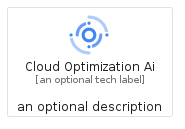
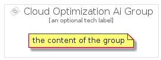

# CloudOptimizationAi


```text
gcp/Item/CloudOptimizationAi
```

```text
include('gcp/Item/CloudOptimizationAi')
```


| Illustration | CloudOptimizationAi | CloudOptimizationAiCard | CloudOptimizationAiGroup |
| :---: | :---: | :---: | :---: |
|  |  |  |  |


## Sprites
The item provides the following sriptes:

- `<$CloudOptimizationAiXs>`
- `<$CloudOptimizationAiSm>`
- `<$CloudOptimizationAiMd>`
- `<$CloudOptimizationAiLg>`


## CloudOptimizationAi

### Load remotely
```plantuml
@startuml
' configures the library
!global $LIB_BASE_LOCATION="https://raw.githubusercontent.com/tmorin/plantuml-libs/master/distribution"

' loads the library's bootstrap
!include $LIB_BASE_LOCATION/bootstrap.puml

' loads the package bootstrap
include('gcp/bootstrap')

' loads the Item which embeds the element CloudOptimizationAi
include('gcp/Item/CloudOptimizationAi')

' renders the element
CloudOptimizationAi('CloudOptimizationAi', 'Cloud Optimization Ai', 'an optional tech label', 'an optional description')
@enduml
```

### Load locally
```plantuml
@startuml
' configures the library
!global $INCLUSION_MODE="local"
!global $LIB_BASE_LOCATION="../.."

' loads the library's bootstrap
!include $LIB_BASE_LOCATION/bootstrap.puml

' loads the package bootstrap
include('gcp/bootstrap')

' loads the Item which embeds the element CloudOptimizationAi
include('gcp/Item/CloudOptimizationAi')

' renders the element
CloudOptimizationAi('CloudOptimizationAi', 'Cloud Optimization Ai', 'an optional tech label', 'an optional description')
@enduml
```

## CloudOptimizationAiCard

### Load remotely
```plantuml
@startuml
' configures the library
!global $LIB_BASE_LOCATION="https://raw.githubusercontent.com/tmorin/plantuml-libs/master/distribution"

' loads the library's bootstrap
!include $LIB_BASE_LOCATION/bootstrap.puml

' loads the package bootstrap
include('gcp/bootstrap')

' loads the Item which embeds the element CloudOptimizationAiCard
include('gcp/Item/CloudOptimizationAi')

' renders the element
CloudOptimizationAiCard('CloudOptimizationAiCard', 'Cloud Optimization Ai Card', 'an optional description')
@enduml
```

### Load locally
```plantuml
@startuml
' configures the library
!global $INCLUSION_MODE="local"
!global $LIB_BASE_LOCATION="../.."

' loads the library's bootstrap
!include $LIB_BASE_LOCATION/bootstrap.puml

' loads the package bootstrap
include('gcp/bootstrap')

' loads the Item which embeds the element CloudOptimizationAiCard
include('gcp/Item/CloudOptimizationAi')

' renders the element
CloudOptimizationAiCard('CloudOptimizationAiCard', 'Cloud Optimization Ai Card', 'an optional description')
@enduml
```

## CloudOptimizationAiGroup

### Load remotely
```plantuml
@startuml
' configures the library
!global $LIB_BASE_LOCATION="https://raw.githubusercontent.com/tmorin/plantuml-libs/master/distribution"

' loads the library's bootstrap
!include $LIB_BASE_LOCATION/bootstrap.puml

' loads the package bootstrap
include('gcp/bootstrap')

' loads the Item which embeds the element CloudOptimizationAiGroup
include('gcp/Item/CloudOptimizationAi')

' renders the element
CloudOptimizationAiGroup('CloudOptimizationAiGroup', 'Cloud Optimization Ai Group', 'an optional tech label') {
    note as note
        the content of the group
    end note
}
@enduml
```

### Load locally
```plantuml
@startuml
' configures the library
!global $INCLUSION_MODE="local"
!global $LIB_BASE_LOCATION="../.."

' loads the library's bootstrap
!include $LIB_BASE_LOCATION/bootstrap.puml

' loads the package bootstrap
include('gcp/bootstrap')

' loads the Item which embeds the element CloudOptimizationAiGroup
include('gcp/Item/CloudOptimizationAi')

' renders the element
CloudOptimizationAiGroup('CloudOptimizationAiGroup', 'Cloud Optimization Ai Group', 'an optional tech label') {
    note as note
        the content of the group
    end note
}
@enduml
```

