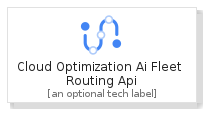
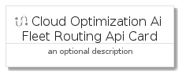
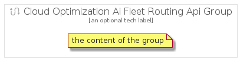

# CloudOptimizationAiFleetRoutingApi


```text
gcp/Item/CloudOptimizationAiFleetRoutingApi
```

```text
include('gcp/Item/CloudOptimizationAiFleetRoutingApi')
```


| Illustration | CloudOptimizationAiFleetRoutingApi | CloudOptimizationAiFleetRoutingApiCard | CloudOptimizationAiFleetRoutingApiGroup |
| :---: | :---: | :---: | :---: |
|  |  |  |  |


## CloudOptimizationAiFleetRoutingApi

### Load remotely
```plantuml
@startuml
' configures the library
!global $LIB_BASE_LOCATION="https://raw.githubusercontent.com/tmorin/plantuml-libs/master/distribution"

' loads the library's bootstrap
!include $LIB_BASE_LOCATION/bootstrap.puml

' loads the package bootstrap
include('gcp/bootstrap')

' loads the Item which embeds the element CloudOptimizationAiFleetRoutingApi
include('gcp/Item/CloudOptimizationAiFleetRoutingApi')

' renders the element
CloudOptimizationAiFleetRoutingApi('CloudOptimizationAiFleetRoutingApi', 'Cloud Optimization Ai Fleet Routing Api', 'an optional tech label', 'an optional description')
@enduml
```

### Load locally
```plantuml
@startuml
' configures the library
!global $INCLUSION_MODE="local"
!global $LIB_BASE_LOCATION="../.."

' loads the library's bootstrap
!include $LIB_BASE_LOCATION/bootstrap.puml

' loads the package bootstrap
include('gcp/bootstrap')

' loads the Item which embeds the element CloudOptimizationAiFleetRoutingApi
include('gcp/Item/CloudOptimizationAiFleetRoutingApi')

' renders the element
CloudOptimizationAiFleetRoutingApi('CloudOptimizationAiFleetRoutingApi', 'Cloud Optimization Ai Fleet Routing Api', 'an optional tech label', 'an optional description')
@enduml
```

## CloudOptimizationAiFleetRoutingApiCard

### Load remotely
```plantuml
@startuml
' configures the library
!global $LIB_BASE_LOCATION="https://raw.githubusercontent.com/tmorin/plantuml-libs/master/distribution"

' loads the library's bootstrap
!include $LIB_BASE_LOCATION/bootstrap.puml

' loads the package bootstrap
include('gcp/bootstrap')

' loads the Item which embeds the element CloudOptimizationAiFleetRoutingApiCard
include('gcp/Item/CloudOptimizationAiFleetRoutingApi')

' renders the element
CloudOptimizationAiFleetRoutingApiCard('CloudOptimizationAiFleetRoutingApiCard', 'Cloud Optimization Ai Fleet Routing Api Card', 'an optional description')
@enduml
```

### Load locally
```plantuml
@startuml
' configures the library
!global $INCLUSION_MODE="local"
!global $LIB_BASE_LOCATION="../.."

' loads the library's bootstrap
!include $LIB_BASE_LOCATION/bootstrap.puml

' loads the package bootstrap
include('gcp/bootstrap')

' loads the Item which embeds the element CloudOptimizationAiFleetRoutingApiCard
include('gcp/Item/CloudOptimizationAiFleetRoutingApi')

' renders the element
CloudOptimizationAiFleetRoutingApiCard('CloudOptimizationAiFleetRoutingApiCard', 'Cloud Optimization Ai Fleet Routing Api Card', 'an optional description')
@enduml
```

## CloudOptimizationAiFleetRoutingApiGroup

### Load remotely
```plantuml
@startuml
' configures the library
!global $LIB_BASE_LOCATION="https://raw.githubusercontent.com/tmorin/plantuml-libs/master/distribution"

' loads the library's bootstrap
!include $LIB_BASE_LOCATION/bootstrap.puml

' loads the package bootstrap
include('gcp/bootstrap')

' loads the Item which embeds the element CloudOptimizationAiFleetRoutingApiGroup
include('gcp/Item/CloudOptimizationAiFleetRoutingApi')

' renders the element
CloudOptimizationAiFleetRoutingApiGroup('CloudOptimizationAiFleetRoutingApiGroup', 'Cloud Optimization Ai Fleet Routing Api Group', 'an optional tech label') {
    note as note
        the content of the group
    end note
}
@enduml
```

### Load locally
```plantuml
@startuml
' configures the library
!global $INCLUSION_MODE="local"
!global $LIB_BASE_LOCATION="../.."

' loads the library's bootstrap
!include $LIB_BASE_LOCATION/bootstrap.puml

' loads the package bootstrap
include('gcp/bootstrap')

' loads the Item which embeds the element CloudOptimizationAiFleetRoutingApiGroup
include('gcp/Item/CloudOptimizationAiFleetRoutingApi')

' renders the element
CloudOptimizationAiFleetRoutingApiGroup('CloudOptimizationAiFleetRoutingApiGroup', 'Cloud Optimization Ai Fleet Routing Api Group', 'an optional tech label') {
    note as note
        the content of the group
    end note
}
@enduml
```

