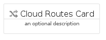
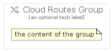

# CloudRoutes


```text
gcp/Item/CloudRoutes
```

```text
include('gcp/Item/CloudRoutes')
```


| Illustration | CloudRoutes | CloudRoutesCard | CloudRoutesGroup |
| :---: | :---: | :---: | :---: |
|  |  |  |  |


## CloudRoutes

### Load remotely
```plantuml
@startuml
' configures the library
!global $LIB_BASE_LOCATION="https://raw.githubusercontent.com/tmorin/plantuml-libs/master/distribution"

' loads the library's bootstrap
!include $LIB_BASE_LOCATION/bootstrap.puml

' loads the package bootstrap
include('gcp/bootstrap')

' loads the Item which embeds the element CloudRoutes
include('gcp/Item/CloudRoutes')

' renders the element
CloudRoutes('CloudRoutes', 'Cloud Routes', 'an optional tech label')
@enduml
```

### Load locally
```plantuml
@startuml
' configures the library
!global $INCLUSION_MODE="local"
!global $LIB_BASE_LOCATION="../.."

' loads the library's bootstrap
!include $LIB_BASE_LOCATION/bootstrap.puml

' loads the package bootstrap
include('gcp/bootstrap')

' loads the Item which embeds the element CloudRoutes
include('gcp/Item/CloudRoutes')

' renders the element
CloudRoutes('CloudRoutes', 'Cloud Routes', 'an optional tech label')
@enduml
```

## CloudRoutesCard

### Load remotely
```plantuml
@startuml
' configures the library
!global $LIB_BASE_LOCATION="https://raw.githubusercontent.com/tmorin/plantuml-libs/master/distribution"

' loads the library's bootstrap
!include $LIB_BASE_LOCATION/bootstrap.puml

' loads the package bootstrap
include('gcp/bootstrap')

' loads the Item which embeds the element CloudRoutesCard
include('gcp/Item/CloudRoutes')

' renders the element
CloudRoutesCard('CloudRoutesCard', 'Cloud Routes Card', 'an optional description')
@enduml
```

### Load locally
```plantuml
@startuml
' configures the library
!global $INCLUSION_MODE="local"
!global $LIB_BASE_LOCATION="../.."

' loads the library's bootstrap
!include $LIB_BASE_LOCATION/bootstrap.puml

' loads the package bootstrap
include('gcp/bootstrap')

' loads the Item which embeds the element CloudRoutesCard
include('gcp/Item/CloudRoutes')

' renders the element
CloudRoutesCard('CloudRoutesCard', 'Cloud Routes Card', 'an optional description')
@enduml
```

## CloudRoutesGroup

### Load remotely
```plantuml
@startuml
' configures the library
!global $LIB_BASE_LOCATION="https://raw.githubusercontent.com/tmorin/plantuml-libs/master/distribution"

' loads the library's bootstrap
!include $LIB_BASE_LOCATION/bootstrap.puml

' loads the package bootstrap
include('gcp/bootstrap')

' loads the Item which embeds the element CloudRoutesGroup
include('gcp/Item/CloudRoutes')

' renders the element
CloudRoutesGroup('CloudRoutesGroup', 'Cloud Routes Group', 'an optional tech label') {
    note as note
        the content of the group
    end note
}
@enduml
```

### Load locally
```plantuml
@startuml
' configures the library
!global $INCLUSION_MODE="local"
!global $LIB_BASE_LOCATION="../.."

' loads the library's bootstrap
!include $LIB_BASE_LOCATION/bootstrap.puml

' loads the package bootstrap
include('gcp/bootstrap')

' loads the Item which embeds the element CloudRoutesGroup
include('gcp/Item/CloudRoutes')

' renders the element
CloudRoutesGroup('CloudRoutesGroup', 'Cloud Routes Group', 'an optional tech label') {
    note as note
        the content of the group
    end note
}
@enduml
```

