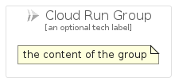

# CloudRun


```text
gcp/Item/CloudRun
```

```text
include('gcp/Item/CloudRun')
```


| Illustration | CloudRun | CloudRunCard | CloudRunGroup |
| :---: | :---: | :---: | :---: |
|  |  |  |  |


## CloudRun

### Load remotely
```plantuml
@startuml
' configures the library
!global $LIB_BASE_LOCATION="https://raw.githubusercontent.com/tmorin/plantuml-libs/master/distribution"

' loads the library's bootstrap
!include $LIB_BASE_LOCATION/bootstrap.puml

' loads the package bootstrap
include('gcp/bootstrap')

' loads the Item which embeds the element CloudRun
include('gcp/Item/CloudRun')

' renders the element
CloudRun('CloudRun', 'Cloud Run', 'an optional tech label')
@enduml
```

### Load locally
```plantuml
@startuml
' configures the library
!global $INCLUSION_MODE="local"
!global $LIB_BASE_LOCATION="../.."

' loads the library's bootstrap
!include $LIB_BASE_LOCATION/bootstrap.puml

' loads the package bootstrap
include('gcp/bootstrap')

' loads the Item which embeds the element CloudRun
include('gcp/Item/CloudRun')

' renders the element
CloudRun('CloudRun', 'Cloud Run', 'an optional tech label')
@enduml
```

## CloudRunCard

### Load remotely
```plantuml
@startuml
' configures the library
!global $LIB_BASE_LOCATION="https://raw.githubusercontent.com/tmorin/plantuml-libs/master/distribution"

' loads the library's bootstrap
!include $LIB_BASE_LOCATION/bootstrap.puml

' loads the package bootstrap
include('gcp/bootstrap')

' loads the Item which embeds the element CloudRunCard
include('gcp/Item/CloudRun')

' renders the element
CloudRunCard('CloudRunCard', 'Cloud Run Card', 'an optional description')
@enduml
```

### Load locally
```plantuml
@startuml
' configures the library
!global $INCLUSION_MODE="local"
!global $LIB_BASE_LOCATION="../.."

' loads the library's bootstrap
!include $LIB_BASE_LOCATION/bootstrap.puml

' loads the package bootstrap
include('gcp/bootstrap')

' loads the Item which embeds the element CloudRunCard
include('gcp/Item/CloudRun')

' renders the element
CloudRunCard('CloudRunCard', 'Cloud Run Card', 'an optional description')
@enduml
```

## CloudRunGroup

### Load remotely
```plantuml
@startuml
' configures the library
!global $LIB_BASE_LOCATION="https://raw.githubusercontent.com/tmorin/plantuml-libs/master/distribution"

' loads the library's bootstrap
!include $LIB_BASE_LOCATION/bootstrap.puml

' loads the package bootstrap
include('gcp/bootstrap')

' loads the Item which embeds the element CloudRunGroup
include('gcp/Item/CloudRun')

' renders the element
CloudRunGroup('CloudRunGroup', 'Cloud Run Group', 'an optional tech label') {
    note as note
        the content of the group
    end note
}
@enduml
```

### Load locally
```plantuml
@startuml
' configures the library
!global $INCLUSION_MODE="local"
!global $LIB_BASE_LOCATION="../.."

' loads the library's bootstrap
!include $LIB_BASE_LOCATION/bootstrap.puml

' loads the package bootstrap
include('gcp/bootstrap')

' loads the Item which embeds the element CloudRunGroup
include('gcp/Item/CloudRun')

' renders the element
CloudRunGroup('CloudRunGroup', 'Cloud Run Group', 'an optional tech label') {
    note as note
        the content of the group
    end note
}
@enduml
```

