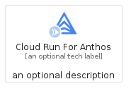
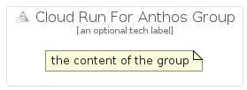

# CloudRunForAnthos


```text
gcp/Item/CloudRunForAnthos
```

```text
include('gcp/Item/CloudRunForAnthos')
```


| Illustration | CloudRunForAnthos | CloudRunForAnthosCard | CloudRunForAnthosGroup |
| :---: | :---: | :---: | :---: |
|  |  |  |  |


## CloudRunForAnthos

### Load remotely
```plantuml
@startuml
' configures the library
!global $LIB_BASE_LOCATION="https://raw.githubusercontent.com/tmorin/plantuml-libs/master/distribution"

' loads the library's bootstrap
!include $LIB_BASE_LOCATION/bootstrap.puml

' loads the package bootstrap
include('gcp/bootstrap')

' loads the Item which embeds the element CloudRunForAnthos
include('gcp/Item/CloudRunForAnthos')

' renders the element
CloudRunForAnthos('CloudRunForAnthos', 'Cloud Run For Anthos', 'an optional tech label', 'an optional description')
@enduml
```

### Load locally
```plantuml
@startuml
' configures the library
!global $INCLUSION_MODE="local"
!global $LIB_BASE_LOCATION="../.."

' loads the library's bootstrap
!include $LIB_BASE_LOCATION/bootstrap.puml

' loads the package bootstrap
include('gcp/bootstrap')

' loads the Item which embeds the element CloudRunForAnthos
include('gcp/Item/CloudRunForAnthos')

' renders the element
CloudRunForAnthos('CloudRunForAnthos', 'Cloud Run For Anthos', 'an optional tech label', 'an optional description')
@enduml
```

## CloudRunForAnthosCard

### Load remotely
```plantuml
@startuml
' configures the library
!global $LIB_BASE_LOCATION="https://raw.githubusercontent.com/tmorin/plantuml-libs/master/distribution"

' loads the library's bootstrap
!include $LIB_BASE_LOCATION/bootstrap.puml

' loads the package bootstrap
include('gcp/bootstrap')

' loads the Item which embeds the element CloudRunForAnthosCard
include('gcp/Item/CloudRunForAnthos')

' renders the element
CloudRunForAnthosCard('CloudRunForAnthosCard', 'Cloud Run For Anthos Card', 'an optional description')
@enduml
```

### Load locally
```plantuml
@startuml
' configures the library
!global $INCLUSION_MODE="local"
!global $LIB_BASE_LOCATION="../.."

' loads the library's bootstrap
!include $LIB_BASE_LOCATION/bootstrap.puml

' loads the package bootstrap
include('gcp/bootstrap')

' loads the Item which embeds the element CloudRunForAnthosCard
include('gcp/Item/CloudRunForAnthos')

' renders the element
CloudRunForAnthosCard('CloudRunForAnthosCard', 'Cloud Run For Anthos Card', 'an optional description')
@enduml
```

## CloudRunForAnthosGroup

### Load remotely
```plantuml
@startuml
' configures the library
!global $LIB_BASE_LOCATION="https://raw.githubusercontent.com/tmorin/plantuml-libs/master/distribution"

' loads the library's bootstrap
!include $LIB_BASE_LOCATION/bootstrap.puml

' loads the package bootstrap
include('gcp/bootstrap')

' loads the Item which embeds the element CloudRunForAnthosGroup
include('gcp/Item/CloudRunForAnthos')

' renders the element
CloudRunForAnthosGroup('CloudRunForAnthosGroup', 'Cloud Run For Anthos Group', 'an optional tech label') {
    note as note
        the content of the group
    end note
}
@enduml
```

### Load locally
```plantuml
@startuml
' configures the library
!global $INCLUSION_MODE="local"
!global $LIB_BASE_LOCATION="../.."

' loads the library's bootstrap
!include $LIB_BASE_LOCATION/bootstrap.puml

' loads the package bootstrap
include('gcp/bootstrap')

' loads the Item which embeds the element CloudRunForAnthosGroup
include('gcp/Item/CloudRunForAnthos')

' renders the element
CloudRunForAnthosGroup('CloudRunForAnthosGroup', 'Cloud Run For Anthos Group', 'an optional tech label') {
    note as note
        the content of the group
    end note
}
@enduml
```

