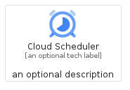
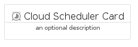
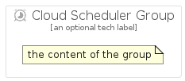

# CloudScheduler


```text
gcp/Item/CloudScheduler
```

```text
include('gcp/Item/CloudScheduler')
```


| Illustration | CloudScheduler | CloudSchedulerCard | CloudSchedulerGroup |
| :---: | :---: | :---: | :---: |
|  |  |  |  |


## Sprites
The item provides the following sriptes:

- `<$CloudSchedulerXs>`
- `<$CloudSchedulerSm>`
- `<$CloudSchedulerMd>`
- `<$CloudSchedulerLg>`


## CloudScheduler

### Load remotely
```plantuml
@startuml
' configures the library
!global $LIB_BASE_LOCATION="https://raw.githubusercontent.com/tmorin/plantuml-libs/master/distribution"

' loads the library's bootstrap
!include $LIB_BASE_LOCATION/bootstrap.puml

' loads the package bootstrap
include('gcp/bootstrap')

' loads the Item which embeds the element CloudScheduler
include('gcp/Item/CloudScheduler')

' renders the element
CloudScheduler('CloudScheduler', 'Cloud Scheduler', 'an optional tech label', 'an optional description')
@enduml
```

### Load locally
```plantuml
@startuml
' configures the library
!global $INCLUSION_MODE="local"
!global $LIB_BASE_LOCATION="../.."

' loads the library's bootstrap
!include $LIB_BASE_LOCATION/bootstrap.puml

' loads the package bootstrap
include('gcp/bootstrap')

' loads the Item which embeds the element CloudScheduler
include('gcp/Item/CloudScheduler')

' renders the element
CloudScheduler('CloudScheduler', 'Cloud Scheduler', 'an optional tech label', 'an optional description')
@enduml
```

## CloudSchedulerCard

### Load remotely
```plantuml
@startuml
' configures the library
!global $LIB_BASE_LOCATION="https://raw.githubusercontent.com/tmorin/plantuml-libs/master/distribution"

' loads the library's bootstrap
!include $LIB_BASE_LOCATION/bootstrap.puml

' loads the package bootstrap
include('gcp/bootstrap')

' loads the Item which embeds the element CloudSchedulerCard
include('gcp/Item/CloudScheduler')

' renders the element
CloudSchedulerCard('CloudSchedulerCard', 'Cloud Scheduler Card', 'an optional description')
@enduml
```

### Load locally
```plantuml
@startuml
' configures the library
!global $INCLUSION_MODE="local"
!global $LIB_BASE_LOCATION="../.."

' loads the library's bootstrap
!include $LIB_BASE_LOCATION/bootstrap.puml

' loads the package bootstrap
include('gcp/bootstrap')

' loads the Item which embeds the element CloudSchedulerCard
include('gcp/Item/CloudScheduler')

' renders the element
CloudSchedulerCard('CloudSchedulerCard', 'Cloud Scheduler Card', 'an optional description')
@enduml
```

## CloudSchedulerGroup

### Load remotely
```plantuml
@startuml
' configures the library
!global $LIB_BASE_LOCATION="https://raw.githubusercontent.com/tmorin/plantuml-libs/master/distribution"

' loads the library's bootstrap
!include $LIB_BASE_LOCATION/bootstrap.puml

' loads the package bootstrap
include('gcp/bootstrap')

' loads the Item which embeds the element CloudSchedulerGroup
include('gcp/Item/CloudScheduler')

' renders the element
CloudSchedulerGroup('CloudSchedulerGroup', 'Cloud Scheduler Group', 'an optional tech label') {
    note as note
        the content of the group
    end note
}
@enduml
```

### Load locally
```plantuml
@startuml
' configures the library
!global $INCLUSION_MODE="local"
!global $LIB_BASE_LOCATION="../.."

' loads the library's bootstrap
!include $LIB_BASE_LOCATION/bootstrap.puml

' loads the package bootstrap
include('gcp/bootstrap')

' loads the Item which embeds the element CloudSchedulerGroup
include('gcp/Item/CloudScheduler')

' renders the element
CloudSchedulerGroup('CloudSchedulerGroup', 'Cloud Scheduler Group', 'an optional tech label') {
    note as note
        the content of the group
    end note
}
@enduml
```

