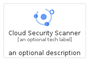
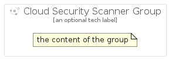

# CloudSecurityScanner


```text
gcp/Item/CloudSecurityScanner
```

```text
include('gcp/Item/CloudSecurityScanner')
```


| Illustration | CloudSecurityScanner | CloudSecurityScannerCard | CloudSecurityScannerGroup |
| :---: | :---: | :---: | :---: |
|  |  |  |  |


## Sprites
The item provides the following sriptes:

- `<$CloudSecurityScannerXs>`
- `<$CloudSecurityScannerSm>`
- `<$CloudSecurityScannerMd>`
- `<$CloudSecurityScannerLg>`


## CloudSecurityScanner

### Load remotely
```plantuml
@startuml
' configures the library
!global $LIB_BASE_LOCATION="https://raw.githubusercontent.com/tmorin/plantuml-libs/master/distribution"

' loads the library's bootstrap
!include $LIB_BASE_LOCATION/bootstrap.puml

' loads the package bootstrap
include('gcp/bootstrap')

' loads the Item which embeds the element CloudSecurityScanner
include('gcp/Item/CloudSecurityScanner')

' renders the element
CloudSecurityScanner('CloudSecurityScanner', 'Cloud Security Scanner', 'an optional tech label', 'an optional description')
@enduml
```

### Load locally
```plantuml
@startuml
' configures the library
!global $INCLUSION_MODE="local"
!global $LIB_BASE_LOCATION="../.."

' loads the library's bootstrap
!include $LIB_BASE_LOCATION/bootstrap.puml

' loads the package bootstrap
include('gcp/bootstrap')

' loads the Item which embeds the element CloudSecurityScanner
include('gcp/Item/CloudSecurityScanner')

' renders the element
CloudSecurityScanner('CloudSecurityScanner', 'Cloud Security Scanner', 'an optional tech label', 'an optional description')
@enduml
```

## CloudSecurityScannerCard

### Load remotely
```plantuml
@startuml
' configures the library
!global $LIB_BASE_LOCATION="https://raw.githubusercontent.com/tmorin/plantuml-libs/master/distribution"

' loads the library's bootstrap
!include $LIB_BASE_LOCATION/bootstrap.puml

' loads the package bootstrap
include('gcp/bootstrap')

' loads the Item which embeds the element CloudSecurityScannerCard
include('gcp/Item/CloudSecurityScanner')

' renders the element
CloudSecurityScannerCard('CloudSecurityScannerCard', 'Cloud Security Scanner Card', 'an optional description')
@enduml
```

### Load locally
```plantuml
@startuml
' configures the library
!global $INCLUSION_MODE="local"
!global $LIB_BASE_LOCATION="../.."

' loads the library's bootstrap
!include $LIB_BASE_LOCATION/bootstrap.puml

' loads the package bootstrap
include('gcp/bootstrap')

' loads the Item which embeds the element CloudSecurityScannerCard
include('gcp/Item/CloudSecurityScanner')

' renders the element
CloudSecurityScannerCard('CloudSecurityScannerCard', 'Cloud Security Scanner Card', 'an optional description')
@enduml
```

## CloudSecurityScannerGroup

### Load remotely
```plantuml
@startuml
' configures the library
!global $LIB_BASE_LOCATION="https://raw.githubusercontent.com/tmorin/plantuml-libs/master/distribution"

' loads the library's bootstrap
!include $LIB_BASE_LOCATION/bootstrap.puml

' loads the package bootstrap
include('gcp/bootstrap')

' loads the Item which embeds the element CloudSecurityScannerGroup
include('gcp/Item/CloudSecurityScanner')

' renders the element
CloudSecurityScannerGroup('CloudSecurityScannerGroup', 'Cloud Security Scanner Group', 'an optional tech label') {
    note as note
        the content of the group
    end note
}
@enduml
```

### Load locally
```plantuml
@startuml
' configures the library
!global $INCLUSION_MODE="local"
!global $LIB_BASE_LOCATION="../.."

' loads the library's bootstrap
!include $LIB_BASE_LOCATION/bootstrap.puml

' loads the package bootstrap
include('gcp/bootstrap')

' loads the Item which embeds the element CloudSecurityScannerGroup
include('gcp/Item/CloudSecurityScanner')

' renders the element
CloudSecurityScannerGroup('CloudSecurityScannerGroup', 'Cloud Security Scanner Group', 'an optional tech label') {
    note as note
        the content of the group
    end note
}
@enduml
```

