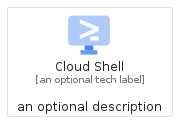
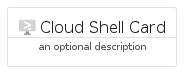
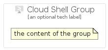

# CloudShell


```text
gcp/Item/CloudShell
```

```text
include('gcp/Item/CloudShell')
```


| Illustration | CloudShell | CloudShellCard | CloudShellGroup |
| :---: | :---: | :---: | :---: |
|  |  |  |  |


## CloudShell

### Load remotely
```plantuml
@startuml
' configures the library
!global $LIB_BASE_LOCATION="https://raw.githubusercontent.com/tmorin/plantuml-libs/master/distribution"

' loads the library's bootstrap
!include $LIB_BASE_LOCATION/bootstrap.puml

' loads the package bootstrap
include('gcp/bootstrap')

' loads the Item which embeds the element CloudShell
include('gcp/Item/CloudShell')

' renders the element
CloudShell('CloudShell', 'Cloud Shell', 'an optional tech label', 'an optional description')
@enduml
```

### Load locally
```plantuml
@startuml
' configures the library
!global $INCLUSION_MODE="local"
!global $LIB_BASE_LOCATION="../.."

' loads the library's bootstrap
!include $LIB_BASE_LOCATION/bootstrap.puml

' loads the package bootstrap
include('gcp/bootstrap')

' loads the Item which embeds the element CloudShell
include('gcp/Item/CloudShell')

' renders the element
CloudShell('CloudShell', 'Cloud Shell', 'an optional tech label', 'an optional description')
@enduml
```

## CloudShellCard

### Load remotely
```plantuml
@startuml
' configures the library
!global $LIB_BASE_LOCATION="https://raw.githubusercontent.com/tmorin/plantuml-libs/master/distribution"

' loads the library's bootstrap
!include $LIB_BASE_LOCATION/bootstrap.puml

' loads the package bootstrap
include('gcp/bootstrap')

' loads the Item which embeds the element CloudShellCard
include('gcp/Item/CloudShell')

' renders the element
CloudShellCard('CloudShellCard', 'Cloud Shell Card', 'an optional description')
@enduml
```

### Load locally
```plantuml
@startuml
' configures the library
!global $INCLUSION_MODE="local"
!global $LIB_BASE_LOCATION="../.."

' loads the library's bootstrap
!include $LIB_BASE_LOCATION/bootstrap.puml

' loads the package bootstrap
include('gcp/bootstrap')

' loads the Item which embeds the element CloudShellCard
include('gcp/Item/CloudShell')

' renders the element
CloudShellCard('CloudShellCard', 'Cloud Shell Card', 'an optional description')
@enduml
```

## CloudShellGroup

### Load remotely
```plantuml
@startuml
' configures the library
!global $LIB_BASE_LOCATION="https://raw.githubusercontent.com/tmorin/plantuml-libs/master/distribution"

' loads the library's bootstrap
!include $LIB_BASE_LOCATION/bootstrap.puml

' loads the package bootstrap
include('gcp/bootstrap')

' loads the Item which embeds the element CloudShellGroup
include('gcp/Item/CloudShell')

' renders the element
CloudShellGroup('CloudShellGroup', 'Cloud Shell Group', 'an optional tech label') {
    note as note
        the content of the group
    end note
}
@enduml
```

### Load locally
```plantuml
@startuml
' configures the library
!global $INCLUSION_MODE="local"
!global $LIB_BASE_LOCATION="../.."

' loads the library's bootstrap
!include $LIB_BASE_LOCATION/bootstrap.puml

' loads the package bootstrap
include('gcp/bootstrap')

' loads the Item which embeds the element CloudShellGroup
include('gcp/Item/CloudShell')

' renders the element
CloudShellGroup('CloudShellGroup', 'Cloud Shell Group', 'an optional tech label') {
    note as note
        the content of the group
    end note
}
@enduml
```

