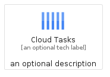
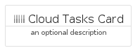
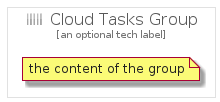

# CloudTasks


```text
gcp/Item/CloudTasks
```

```text
include('gcp/Item/CloudTasks')
```


| Illustration | CloudTasks | CloudTasksCard | CloudTasksGroup |
| :---: | :---: | :---: | :---: |
|  |  |  |  |


## CloudTasks

### Load remotely
```plantuml
@startuml
' configures the library
!global $LIB_BASE_LOCATION="https://raw.githubusercontent.com/tmorin/plantuml-libs/master/distribution"

' loads the library's bootstrap
!include $LIB_BASE_LOCATION/bootstrap.puml

' loads the package bootstrap
include('gcp/bootstrap')

' loads the Item which embeds the element CloudTasks
include('gcp/Item/CloudTasks')

' renders the element
CloudTasks('CloudTasks', 'Cloud Tasks', 'an optional tech label', 'an optional description')
@enduml
```

### Load locally
```plantuml
@startuml
' configures the library
!global $INCLUSION_MODE="local"
!global $LIB_BASE_LOCATION="../.."

' loads the library's bootstrap
!include $LIB_BASE_LOCATION/bootstrap.puml

' loads the package bootstrap
include('gcp/bootstrap')

' loads the Item which embeds the element CloudTasks
include('gcp/Item/CloudTasks')

' renders the element
CloudTasks('CloudTasks', 'Cloud Tasks', 'an optional tech label', 'an optional description')
@enduml
```

## CloudTasksCard

### Load remotely
```plantuml
@startuml
' configures the library
!global $LIB_BASE_LOCATION="https://raw.githubusercontent.com/tmorin/plantuml-libs/master/distribution"

' loads the library's bootstrap
!include $LIB_BASE_LOCATION/bootstrap.puml

' loads the package bootstrap
include('gcp/bootstrap')

' loads the Item which embeds the element CloudTasksCard
include('gcp/Item/CloudTasks')

' renders the element
CloudTasksCard('CloudTasksCard', 'Cloud Tasks Card', 'an optional description')
@enduml
```

### Load locally
```plantuml
@startuml
' configures the library
!global $INCLUSION_MODE="local"
!global $LIB_BASE_LOCATION="../.."

' loads the library's bootstrap
!include $LIB_BASE_LOCATION/bootstrap.puml

' loads the package bootstrap
include('gcp/bootstrap')

' loads the Item which embeds the element CloudTasksCard
include('gcp/Item/CloudTasks')

' renders the element
CloudTasksCard('CloudTasksCard', 'Cloud Tasks Card', 'an optional description')
@enduml
```

## CloudTasksGroup

### Load remotely
```plantuml
@startuml
' configures the library
!global $LIB_BASE_LOCATION="https://raw.githubusercontent.com/tmorin/plantuml-libs/master/distribution"

' loads the library's bootstrap
!include $LIB_BASE_LOCATION/bootstrap.puml

' loads the package bootstrap
include('gcp/bootstrap')

' loads the Item which embeds the element CloudTasksGroup
include('gcp/Item/CloudTasks')

' renders the element
CloudTasksGroup('CloudTasksGroup', 'Cloud Tasks Group', 'an optional tech label') {
    note as note
        the content of the group
    end note
}
@enduml
```

### Load locally
```plantuml
@startuml
' configures the library
!global $INCLUSION_MODE="local"
!global $LIB_BASE_LOCATION="../.."

' loads the library's bootstrap
!include $LIB_BASE_LOCATION/bootstrap.puml

' loads the package bootstrap
include('gcp/bootstrap')

' loads the Item which embeds the element CloudTasksGroup
include('gcp/Item/CloudTasks')

' renders the element
CloudTasksGroup('CloudTasksGroup', 'Cloud Tasks Group', 'an optional tech label') {
    note as note
        the content of the group
    end note
}
@enduml
```

