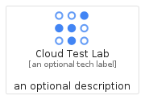
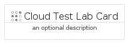

# CloudTestLab


```text
gcp/Item/CloudTestLab
```

```text
include('gcp/Item/CloudTestLab')
```


| Illustration | CloudTestLab | CloudTestLabCard | CloudTestLabGroup |
| :---: | :---: | :---: | :---: |
|  |  |  |  |


## CloudTestLab

### Load remotely
```plantuml
@startuml
' configures the library
!global $LIB_BASE_LOCATION="https://raw.githubusercontent.com/tmorin/plantuml-libs/master/distribution"

' loads the library's bootstrap
!include $LIB_BASE_LOCATION/bootstrap.puml

' loads the package bootstrap
include('gcp/bootstrap')

' loads the Item which embeds the element CloudTestLab
include('gcp/Item/CloudTestLab')

' renders the element
CloudTestLab('CloudTestLab', 'Cloud Test Lab', 'an optional tech label')
@enduml
```

### Load locally
```plantuml
@startuml
' configures the library
!global $INCLUSION_MODE="local"
!global $LIB_BASE_LOCATION="../.."

' loads the library's bootstrap
!include $LIB_BASE_LOCATION/bootstrap.puml

' loads the package bootstrap
include('gcp/bootstrap')

' loads the Item which embeds the element CloudTestLab
include('gcp/Item/CloudTestLab')

' renders the element
CloudTestLab('CloudTestLab', 'Cloud Test Lab', 'an optional tech label')
@enduml
```

## CloudTestLabCard

### Load remotely
```plantuml
@startuml
' configures the library
!global $LIB_BASE_LOCATION="https://raw.githubusercontent.com/tmorin/plantuml-libs/master/distribution"

' loads the library's bootstrap
!include $LIB_BASE_LOCATION/bootstrap.puml

' loads the package bootstrap
include('gcp/bootstrap')

' loads the Item which embeds the element CloudTestLabCard
include('gcp/Item/CloudTestLab')

' renders the element
CloudTestLabCard('CloudTestLabCard', 'Cloud Test Lab Card', 'an optional description')
@enduml
```

### Load locally
```plantuml
@startuml
' configures the library
!global $INCLUSION_MODE="local"
!global $LIB_BASE_LOCATION="../.."

' loads the library's bootstrap
!include $LIB_BASE_LOCATION/bootstrap.puml

' loads the package bootstrap
include('gcp/bootstrap')

' loads the Item which embeds the element CloudTestLabCard
include('gcp/Item/CloudTestLab')

' renders the element
CloudTestLabCard('CloudTestLabCard', 'Cloud Test Lab Card', 'an optional description')
@enduml
```

## CloudTestLabGroup

### Load remotely
```plantuml
@startuml
' configures the library
!global $LIB_BASE_LOCATION="https://raw.githubusercontent.com/tmorin/plantuml-libs/master/distribution"

' loads the library's bootstrap
!include $LIB_BASE_LOCATION/bootstrap.puml

' loads the package bootstrap
include('gcp/bootstrap')

' loads the Item which embeds the element CloudTestLabGroup
include('gcp/Item/CloudTestLab')

' renders the element
CloudTestLabGroup('CloudTestLabGroup', 'Cloud Test Lab Group', 'an optional tech label') {
    note as note
        the content of the group
    end note
}
@enduml
```

### Load locally
```plantuml
@startuml
' configures the library
!global $INCLUSION_MODE="local"
!global $LIB_BASE_LOCATION="../.."

' loads the library's bootstrap
!include $LIB_BASE_LOCATION/bootstrap.puml

' loads the package bootstrap
include('gcp/bootstrap')

' loads the Item which embeds the element CloudTestLabGroup
include('gcp/Item/CloudTestLab')

' renders the element
CloudTestLabGroup('CloudTestLabGroup', 'Cloud Test Lab Group', 'an optional tech label') {
    note as note
        the content of the group
    end note
}
@enduml
```

