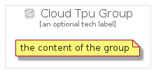

# CloudTpu


```text
gcp/Item/CloudTpu
```

```text
include('gcp/Item/CloudTpu')
```


| Illustration | CloudTpu | CloudTpuCard | CloudTpuGroup |
| :---: | :---: | :---: | :---: |
|  |  |  |  |


## Sprites
The item provides the following sriptes:

- `<$CloudTpuXs>`
- `<$CloudTpuSm>`
- `<$CloudTpuMd>`
- `<$CloudTpuLg>`


## CloudTpu

### Load remotely
```plantuml
@startuml
' configures the library
!global $LIB_BASE_LOCATION="https://raw.githubusercontent.com/tmorin/plantuml-libs/master/distribution"

' loads the library's bootstrap
!include $LIB_BASE_LOCATION/bootstrap.puml

' loads the package bootstrap
include('gcp/bootstrap')

' loads the Item which embeds the element CloudTpu
include('gcp/Item/CloudTpu')

' renders the element
CloudTpu('CloudTpu', 'Cloud Tpu', 'an optional tech label', 'an optional description')
@enduml
```

### Load locally
```plantuml
@startuml
' configures the library
!global $INCLUSION_MODE="local"
!global $LIB_BASE_LOCATION="../.."

' loads the library's bootstrap
!include $LIB_BASE_LOCATION/bootstrap.puml

' loads the package bootstrap
include('gcp/bootstrap')

' loads the Item which embeds the element CloudTpu
include('gcp/Item/CloudTpu')

' renders the element
CloudTpu('CloudTpu', 'Cloud Tpu', 'an optional tech label', 'an optional description')
@enduml
```

## CloudTpuCard

### Load remotely
```plantuml
@startuml
' configures the library
!global $LIB_BASE_LOCATION="https://raw.githubusercontent.com/tmorin/plantuml-libs/master/distribution"

' loads the library's bootstrap
!include $LIB_BASE_LOCATION/bootstrap.puml

' loads the package bootstrap
include('gcp/bootstrap')

' loads the Item which embeds the element CloudTpuCard
include('gcp/Item/CloudTpu')

' renders the element
CloudTpuCard('CloudTpuCard', 'Cloud Tpu Card', 'an optional description')
@enduml
```

### Load locally
```plantuml
@startuml
' configures the library
!global $INCLUSION_MODE="local"
!global $LIB_BASE_LOCATION="../.."

' loads the library's bootstrap
!include $LIB_BASE_LOCATION/bootstrap.puml

' loads the package bootstrap
include('gcp/bootstrap')

' loads the Item which embeds the element CloudTpuCard
include('gcp/Item/CloudTpu')

' renders the element
CloudTpuCard('CloudTpuCard', 'Cloud Tpu Card', 'an optional description')
@enduml
```

## CloudTpuGroup

### Load remotely
```plantuml
@startuml
' configures the library
!global $LIB_BASE_LOCATION="https://raw.githubusercontent.com/tmorin/plantuml-libs/master/distribution"

' loads the library's bootstrap
!include $LIB_BASE_LOCATION/bootstrap.puml

' loads the package bootstrap
include('gcp/bootstrap')

' loads the Item which embeds the element CloudTpuGroup
include('gcp/Item/CloudTpu')

' renders the element
CloudTpuGroup('CloudTpuGroup', 'Cloud Tpu Group', 'an optional tech label') {
    note as note
        the content of the group
    end note
}
@enduml
```

### Load locally
```plantuml
@startuml
' configures the library
!global $INCLUSION_MODE="local"
!global $LIB_BASE_LOCATION="../.."

' loads the library's bootstrap
!include $LIB_BASE_LOCATION/bootstrap.puml

' loads the package bootstrap
include('gcp/bootstrap')

' loads the Item which embeds the element CloudTpuGroup
include('gcp/Item/CloudTpu')

' renders the element
CloudTpuGroup('CloudTpuGroup', 'Cloud Tpu Group', 'an optional tech label') {
    note as note
        the content of the group
    end note
}
@enduml
```

