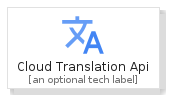
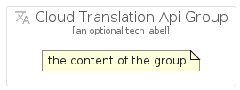

# CloudTranslationApi


```text
gcp/Item/CloudTranslationApi
```

```text
include('gcp/Item/CloudTranslationApi')
```


| Illustration | CloudTranslationApi | CloudTranslationApiCard | CloudTranslationApiGroup |
| :---: | :---: | :---: | :---: |
|  |  |  |  |


## CloudTranslationApi

### Load remotely
```plantuml
@startuml
' configures the library
!global $LIB_BASE_LOCATION="https://raw.githubusercontent.com/tmorin/plantuml-libs/master/distribution"

' loads the library's bootstrap
!include $LIB_BASE_LOCATION/bootstrap.puml

' loads the package bootstrap
include('gcp/bootstrap')

' loads the Item which embeds the element CloudTranslationApi
include('gcp/Item/CloudTranslationApi')

' renders the element
CloudTranslationApi('CloudTranslationApi', 'Cloud Translation Api', 'an optional tech label')
@enduml
```

### Load locally
```plantuml
@startuml
' configures the library
!global $INCLUSION_MODE="local"
!global $LIB_BASE_LOCATION="../.."

' loads the library's bootstrap
!include $LIB_BASE_LOCATION/bootstrap.puml

' loads the package bootstrap
include('gcp/bootstrap')

' loads the Item which embeds the element CloudTranslationApi
include('gcp/Item/CloudTranslationApi')

' renders the element
CloudTranslationApi('CloudTranslationApi', 'Cloud Translation Api', 'an optional tech label')
@enduml
```

## CloudTranslationApiCard

### Load remotely
```plantuml
@startuml
' configures the library
!global $LIB_BASE_LOCATION="https://raw.githubusercontent.com/tmorin/plantuml-libs/master/distribution"

' loads the library's bootstrap
!include $LIB_BASE_LOCATION/bootstrap.puml

' loads the package bootstrap
include('gcp/bootstrap')

' loads the Item which embeds the element CloudTranslationApiCard
include('gcp/Item/CloudTranslationApi')

' renders the element
CloudTranslationApiCard('CloudTranslationApiCard', 'Cloud Translation Api Card', 'an optional description')
@enduml
```

### Load locally
```plantuml
@startuml
' configures the library
!global $INCLUSION_MODE="local"
!global $LIB_BASE_LOCATION="../.."

' loads the library's bootstrap
!include $LIB_BASE_LOCATION/bootstrap.puml

' loads the package bootstrap
include('gcp/bootstrap')

' loads the Item which embeds the element CloudTranslationApiCard
include('gcp/Item/CloudTranslationApi')

' renders the element
CloudTranslationApiCard('CloudTranslationApiCard', 'Cloud Translation Api Card', 'an optional description')
@enduml
```

## CloudTranslationApiGroup

### Load remotely
```plantuml
@startuml
' configures the library
!global $LIB_BASE_LOCATION="https://raw.githubusercontent.com/tmorin/plantuml-libs/master/distribution"

' loads the library's bootstrap
!include $LIB_BASE_LOCATION/bootstrap.puml

' loads the package bootstrap
include('gcp/bootstrap')

' loads the Item which embeds the element CloudTranslationApiGroup
include('gcp/Item/CloudTranslationApi')

' renders the element
CloudTranslationApiGroup('CloudTranslationApiGroup', 'Cloud Translation Api Group', 'an optional tech label') {
    note as note
        the content of the group
    end note
}
@enduml
```

### Load locally
```plantuml
@startuml
' configures the library
!global $INCLUSION_MODE="local"
!global $LIB_BASE_LOCATION="../.."

' loads the library's bootstrap
!include $LIB_BASE_LOCATION/bootstrap.puml

' loads the package bootstrap
include('gcp/bootstrap')

' loads the Item which embeds the element CloudTranslationApiGroup
include('gcp/Item/CloudTranslationApi')

' renders the element
CloudTranslationApiGroup('CloudTranslationApiGroup', 'Cloud Translation Api Group', 'an optional tech label') {
    note as note
        the content of the group
    end note
}
@enduml
```

