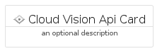
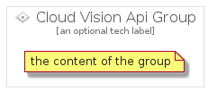

# CloudVisionApi


```text
gcp/Item/CloudVisionApi
```

```text
include('gcp/Item/CloudVisionApi')
```


| Illustration | CloudVisionApi | CloudVisionApiCard | CloudVisionApiGroup |
| :---: | :---: | :---: | :---: |
|  |  |  |  |


## CloudVisionApi

### Load remotely
```plantuml
@startuml
' configures the library
!global $LIB_BASE_LOCATION="https://raw.githubusercontent.com/tmorin/plantuml-libs/master/distribution"

' loads the library's bootstrap
!include $LIB_BASE_LOCATION/bootstrap.puml

' loads the package bootstrap
include('gcp/bootstrap')

' loads the Item which embeds the element CloudVisionApi
include('gcp/Item/CloudVisionApi')

' renders the element
CloudVisionApi('CloudVisionApi', 'Cloud Vision Api', 'an optional tech label', 'an optional description')
@enduml
```

### Load locally
```plantuml
@startuml
' configures the library
!global $INCLUSION_MODE="local"
!global $LIB_BASE_LOCATION="../.."

' loads the library's bootstrap
!include $LIB_BASE_LOCATION/bootstrap.puml

' loads the package bootstrap
include('gcp/bootstrap')

' loads the Item which embeds the element CloudVisionApi
include('gcp/Item/CloudVisionApi')

' renders the element
CloudVisionApi('CloudVisionApi', 'Cloud Vision Api', 'an optional tech label', 'an optional description')
@enduml
```

## CloudVisionApiCard

### Load remotely
```plantuml
@startuml
' configures the library
!global $LIB_BASE_LOCATION="https://raw.githubusercontent.com/tmorin/plantuml-libs/master/distribution"

' loads the library's bootstrap
!include $LIB_BASE_LOCATION/bootstrap.puml

' loads the package bootstrap
include('gcp/bootstrap')

' loads the Item which embeds the element CloudVisionApiCard
include('gcp/Item/CloudVisionApi')

' renders the element
CloudVisionApiCard('CloudVisionApiCard', 'Cloud Vision Api Card', 'an optional description')
@enduml
```

### Load locally
```plantuml
@startuml
' configures the library
!global $INCLUSION_MODE="local"
!global $LIB_BASE_LOCATION="../.."

' loads the library's bootstrap
!include $LIB_BASE_LOCATION/bootstrap.puml

' loads the package bootstrap
include('gcp/bootstrap')

' loads the Item which embeds the element CloudVisionApiCard
include('gcp/Item/CloudVisionApi')

' renders the element
CloudVisionApiCard('CloudVisionApiCard', 'Cloud Vision Api Card', 'an optional description')
@enduml
```

## CloudVisionApiGroup

### Load remotely
```plantuml
@startuml
' configures the library
!global $LIB_BASE_LOCATION="https://raw.githubusercontent.com/tmorin/plantuml-libs/master/distribution"

' loads the library's bootstrap
!include $LIB_BASE_LOCATION/bootstrap.puml

' loads the package bootstrap
include('gcp/bootstrap')

' loads the Item which embeds the element CloudVisionApiGroup
include('gcp/Item/CloudVisionApi')

' renders the element
CloudVisionApiGroup('CloudVisionApiGroup', 'Cloud Vision Api Group', 'an optional tech label') {
    note as note
        the content of the group
    end note
}
@enduml
```

### Load locally
```plantuml
@startuml
' configures the library
!global $INCLUSION_MODE="local"
!global $LIB_BASE_LOCATION="../.."

' loads the library's bootstrap
!include $LIB_BASE_LOCATION/bootstrap.puml

' loads the package bootstrap
include('gcp/bootstrap')

' loads the Item which embeds the element CloudVisionApiGroup
include('gcp/Item/CloudVisionApi')

' renders the element
CloudVisionApiGroup('CloudVisionApiGroup', 'Cloud Vision Api Group', 'an optional tech label') {
    note as note
        the content of the group
    end note
}
@enduml
```

