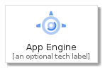
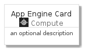
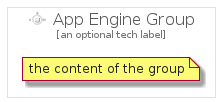

# AppEngine


```text
gcp/Item/Compute/AppEngine
```

```text
include('gcp/Item/Compute/AppEngine')
```


| Illustration | AppEngine | AppEngineCard | AppEngineGroup |
| :---: | :---: | :---: | :---: |
|  |  |  |  |


## AppEngine

### Load remotely
```plantuml
@startuml
' configures the library
!global $LIB_BASE_LOCATION="https://github.com/tmorin/plantuml-libs/distribution"

' loads the library's bootstrap
!include $LIB_BASE_LOCATION/bootstrap.puml

' loads the package bootstrap
include('gcp/bootstrap')

' loads the Item which embeds the element AppEngine
include('gcp/Item/Compute/AppEngine')

' renders the element
AppEngine('AppEngine', 'App Engine', 'an optional tech label')
@enduml
```

### Load locally
```plantuml
@startuml
' configures the library
!global $INCLUSION_MODE="local"
!global $LIB_BASE_LOCATION="../../.."

' loads the library's bootstrap
!include $LIB_BASE_LOCATION/bootstrap.puml

' loads the package bootstrap
include('gcp/bootstrap')

' loads the Item which embeds the element AppEngine
include('gcp/Item/Compute/AppEngine')

' renders the element
AppEngine('AppEngine', 'App Engine', 'an optional tech label')
@enduml
```

## AppEngineCard

### Load remotely
```plantuml
@startuml
' configures the library
!global $LIB_BASE_LOCATION="https://github.com/tmorin/plantuml-libs/distribution"

' loads the library's bootstrap
!include $LIB_BASE_LOCATION/bootstrap.puml

' loads the package bootstrap
include('gcp/bootstrap')

' loads the Item which embeds the element AppEngineCard
include('gcp/Item/Compute/AppEngine')

' renders the element
AppEngineCard('AppEngineCard', 'App Engine Card', 'an optional description')
@enduml
```

### Load locally
```plantuml
@startuml
' configures the library
!global $INCLUSION_MODE="local"
!global $LIB_BASE_LOCATION="../../.."

' loads the library's bootstrap
!include $LIB_BASE_LOCATION/bootstrap.puml

' loads the package bootstrap
include('gcp/bootstrap')

' loads the Item which embeds the element AppEngineCard
include('gcp/Item/Compute/AppEngine')

' renders the element
AppEngineCard('AppEngineCard', 'App Engine Card', 'an optional description')
@enduml
```

## AppEngineGroup

### Load remotely
```plantuml
@startuml
' configures the library
!global $LIB_BASE_LOCATION="https://github.com/tmorin/plantuml-libs/distribution"

' loads the library's bootstrap
!include $LIB_BASE_LOCATION/bootstrap.puml

' loads the package bootstrap
include('gcp/bootstrap')

' loads the Item which embeds the element AppEngineGroup
include('gcp/Item/Compute/AppEngine')

' renders the element
AppEngineGroup('AppEngineGroup', 'App Engine Group', 'an optional tech label') {
    note as note
        the content of the group
    end note
}
@enduml
```

### Load locally
```plantuml
@startuml
' configures the library
!global $INCLUSION_MODE="local"
!global $LIB_BASE_LOCATION="../../.."

' loads the library's bootstrap
!include $LIB_BASE_LOCATION/bootstrap.puml

' loads the package bootstrap
include('gcp/bootstrap')

' loads the Item which embeds the element AppEngineGroup
include('gcp/Item/Compute/AppEngine')

' renders the element
AppEngineGroup('AppEngineGroup', 'App Engine Group', 'an optional tech label') {
    note as note
        the content of the group
    end note
}
@enduml
```

