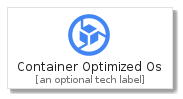
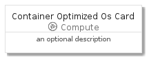
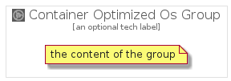

# ContainerOptimizedOs


```text
gcp/Item/Compute/ContainerOptimizedOs
```

```text
include('gcp/Item/Compute/ContainerOptimizedOs')
```


| Illustration | ContainerOptimizedOs | ContainerOptimizedOsCard | ContainerOptimizedOsGroup |
| :---: | :---: | :---: | :---: |
|  |  |  |  |


## ContainerOptimizedOs

### Load remotely
```plantuml
@startuml
' configures the library
!global $LIB_BASE_LOCATION="https://raw.githubusercontent.com/tmorin/plantuml-libs/master/distribution"

' loads the library's bootstrap
!include $LIB_BASE_LOCATION/bootstrap.puml

' loads the package bootstrap
include('gcp/bootstrap')

' loads the Item which embeds the element ContainerOptimizedOs
include('gcp/Item/Compute/ContainerOptimizedOs')

' renders the element
ContainerOptimizedOs('ContainerOptimizedOs', 'Container Optimized Os', 'an optional tech label')
@enduml
```

### Load locally
```plantuml
@startuml
' configures the library
!global $INCLUSION_MODE="local"
!global $LIB_BASE_LOCATION="../../.."

' loads the library's bootstrap
!include $LIB_BASE_LOCATION/bootstrap.puml

' loads the package bootstrap
include('gcp/bootstrap')

' loads the Item which embeds the element ContainerOptimizedOs
include('gcp/Item/Compute/ContainerOptimizedOs')

' renders the element
ContainerOptimizedOs('ContainerOptimizedOs', 'Container Optimized Os', 'an optional tech label')
@enduml
```

## ContainerOptimizedOsCard

### Load remotely
```plantuml
@startuml
' configures the library
!global $LIB_BASE_LOCATION="https://raw.githubusercontent.com/tmorin/plantuml-libs/master/distribution"

' loads the library's bootstrap
!include $LIB_BASE_LOCATION/bootstrap.puml

' loads the package bootstrap
include('gcp/bootstrap')

' loads the Item which embeds the element ContainerOptimizedOsCard
include('gcp/Item/Compute/ContainerOptimizedOs')

' renders the element
ContainerOptimizedOsCard('ContainerOptimizedOsCard', 'Container Optimized Os Card', 'an optional description')
@enduml
```

### Load locally
```plantuml
@startuml
' configures the library
!global $INCLUSION_MODE="local"
!global $LIB_BASE_LOCATION="../../.."

' loads the library's bootstrap
!include $LIB_BASE_LOCATION/bootstrap.puml

' loads the package bootstrap
include('gcp/bootstrap')

' loads the Item which embeds the element ContainerOptimizedOsCard
include('gcp/Item/Compute/ContainerOptimizedOs')

' renders the element
ContainerOptimizedOsCard('ContainerOptimizedOsCard', 'Container Optimized Os Card', 'an optional description')
@enduml
```

## ContainerOptimizedOsGroup

### Load remotely
```plantuml
@startuml
' configures the library
!global $LIB_BASE_LOCATION="https://raw.githubusercontent.com/tmorin/plantuml-libs/master/distribution"

' loads the library's bootstrap
!include $LIB_BASE_LOCATION/bootstrap.puml

' loads the package bootstrap
include('gcp/bootstrap')

' loads the Item which embeds the element ContainerOptimizedOsGroup
include('gcp/Item/Compute/ContainerOptimizedOs')

' renders the element
ContainerOptimizedOsGroup('ContainerOptimizedOsGroup', 'Container Optimized Os Group', 'an optional tech label') {
    note as note
        the content of the group
    end note
}
@enduml
```

### Load locally
```plantuml
@startuml
' configures the library
!global $INCLUSION_MODE="local"
!global $LIB_BASE_LOCATION="../../.."

' loads the library's bootstrap
!include $LIB_BASE_LOCATION/bootstrap.puml

' loads the package bootstrap
include('gcp/bootstrap')

' loads the Item which embeds the element ContainerOptimizedOsGroup
include('gcp/Item/Compute/ContainerOptimizedOs')

' renders the element
ContainerOptimizedOsGroup('ContainerOptimizedOsGroup', 'Container Optimized Os Group', 'an optional tech label') {
    note as note
        the content of the group
    end note
}
@enduml
```

