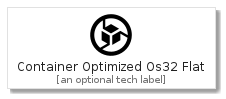
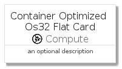

# ContainerOptimizedOs32Flat


```text
gcp/Item/Compute/ContainerOptimizedOs32Flat
```

```text
include('gcp/Item/Compute/ContainerOptimizedOs32Flat')
```


| Illustration | ContainerOptimizedOs32Flat | ContainerOptimizedOs32FlatCard | ContainerOptimizedOs32FlatGroup |
| :---: | :---: | :---: | :---: |
|  |  |  |  |


## ContainerOptimizedOs32Flat

### Load remotely
```plantuml
@startuml
' configures the library
!global $LIB_BASE_LOCATION="https://github.com/tmorin/plantuml-libs/distribution"

' loads the library's bootstrap
!include $LIB_BASE_LOCATION/bootstrap.puml

' loads the package bootstrap
include('gcp/bootstrap')

' loads the Item which embeds the element ContainerOptimizedOs32Flat
include('gcp/Item/Compute/ContainerOptimizedOs32Flat')

' renders the element
ContainerOptimizedOs32Flat('ContainerOptimizedOs32Flat', 'Container Optimized Os32 Flat', 'an optional tech label')
@enduml
```

### Load locally
```plantuml
@startuml
' configures the library
!global $INCLUSION_MODE="local"
!global $LIB_BASE_LOCATION="../../.."

' loads the library's bootstrap
!include $LIB_BASE_LOCATION/bootstrap.puml

' loads the package bootstrap
include('gcp/bootstrap')

' loads the Item which embeds the element ContainerOptimizedOs32Flat
include('gcp/Item/Compute/ContainerOptimizedOs32Flat')

' renders the element
ContainerOptimizedOs32Flat('ContainerOptimizedOs32Flat', 'Container Optimized Os32 Flat', 'an optional tech label')
@enduml
```

## ContainerOptimizedOs32FlatCard

### Load remotely
```plantuml
@startuml
' configures the library
!global $LIB_BASE_LOCATION="https://github.com/tmorin/plantuml-libs/distribution"

' loads the library's bootstrap
!include $LIB_BASE_LOCATION/bootstrap.puml

' loads the package bootstrap
include('gcp/bootstrap')

' loads the Item which embeds the element ContainerOptimizedOs32FlatCard
include('gcp/Item/Compute/ContainerOptimizedOs32Flat')

' renders the element
ContainerOptimizedOs32FlatCard('ContainerOptimizedOs32FlatCard', 'Container Optimized Os32 Flat Card', 'an optional description')
@enduml
```

### Load locally
```plantuml
@startuml
' configures the library
!global $INCLUSION_MODE="local"
!global $LIB_BASE_LOCATION="../../.."

' loads the library's bootstrap
!include $LIB_BASE_LOCATION/bootstrap.puml

' loads the package bootstrap
include('gcp/bootstrap')

' loads the Item which embeds the element ContainerOptimizedOs32FlatCard
include('gcp/Item/Compute/ContainerOptimizedOs32Flat')

' renders the element
ContainerOptimizedOs32FlatCard('ContainerOptimizedOs32FlatCard', 'Container Optimized Os32 Flat Card', 'an optional description')
@enduml
```

## ContainerOptimizedOs32FlatGroup

### Load remotely
```plantuml
@startuml
' configures the library
!global $LIB_BASE_LOCATION="https://github.com/tmorin/plantuml-libs/distribution"

' loads the library's bootstrap
!include $LIB_BASE_LOCATION/bootstrap.puml

' loads the package bootstrap
include('gcp/bootstrap')

' loads the Item which embeds the element ContainerOptimizedOs32FlatGroup
include('gcp/Item/Compute/ContainerOptimizedOs32Flat')

' renders the element
ContainerOptimizedOs32FlatGroup('ContainerOptimizedOs32FlatGroup', 'Container Optimized Os32 Flat Group', 'an optional tech label') {
    note as note
        the content of the group
    end note
}
@enduml
```

### Load locally
```plantuml
@startuml
' configures the library
!global $INCLUSION_MODE="local"
!global $LIB_BASE_LOCATION="../../.."

' loads the library's bootstrap
!include $LIB_BASE_LOCATION/bootstrap.puml

' loads the package bootstrap
include('gcp/bootstrap')

' loads the Item which embeds the element ContainerOptimizedOs32FlatGroup
include('gcp/Item/Compute/ContainerOptimizedOs32Flat')

' renders the element
ContainerOptimizedOs32FlatGroup('ContainerOptimizedOs32FlatGroup', 'Container Optimized Os32 Flat Group', 'an optional tech label') {
    note as note
        the content of the group
    end note
}
@enduml
```

